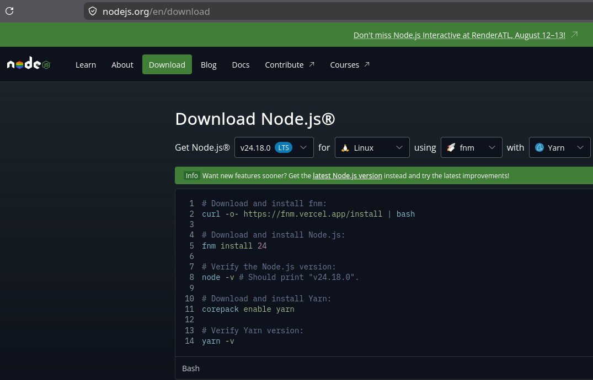
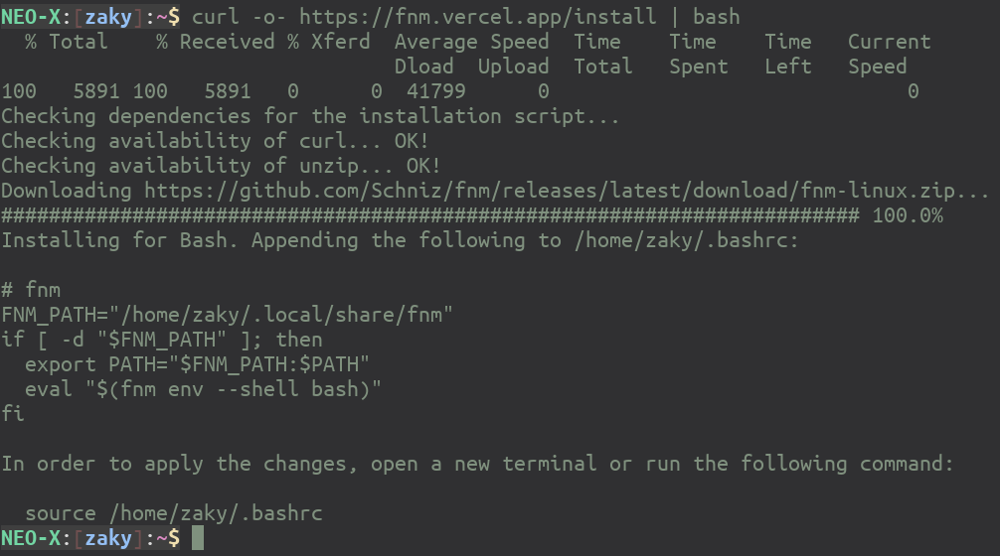
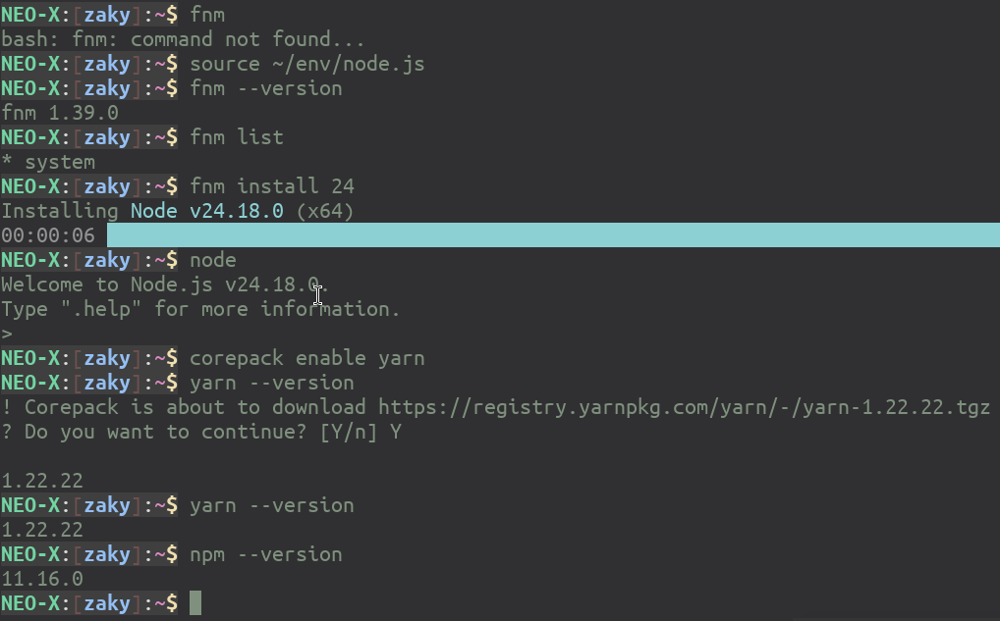
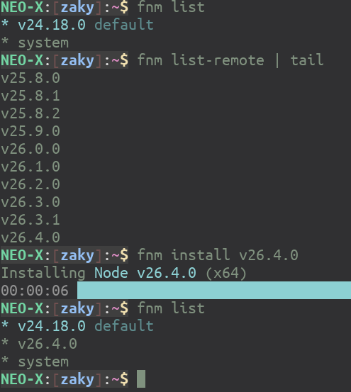
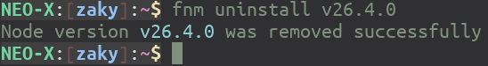

# Instalasi Node.js 

Instalasi [Node.js](https://nodejs.org) bisa dilakukan dengan banyak cara. Kami merekomendasikan penggunaan [fnm](https://github.com/Schniz/fnm). Berikut langkah-langkahnya.

Akses ke halaman [Download](https://nodejs.org/en/download) dari Node.js. Setelah itu, pilih **fnm** beserta **yarn**:



Setelah itu:

```bash 
$ curl -o- https://fnm.vercel.app/install | bash
```



Buat file untuk di-*source* di setiap shell yang akan menggunakan Node.js (misal, letakkan di `$HOME/env/node.js`):

```bash 
# fnm
FNM_PATH="/home/zaky/.local/share/fnm"
if [ -d "$FNM_PATH" ]; then
  export PATH="$FNM_PATH:$PATH"
  eval "$(fnm env --shell bash)"
fi
```

Gambaran penggunaan serta instalasi [Yarn](https://yarnpkg.com/):



Jika menghendaki versi lainnya, install dengan perintah berikut:

 

Jika ingin meng-*uninstall* versi tertentu:

 

Demikian proses instalasi Node.js, happy hacking with Node.js!
