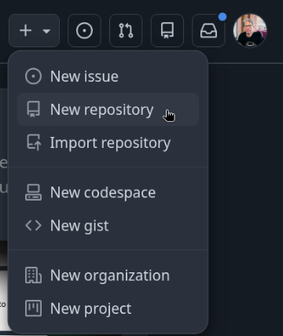
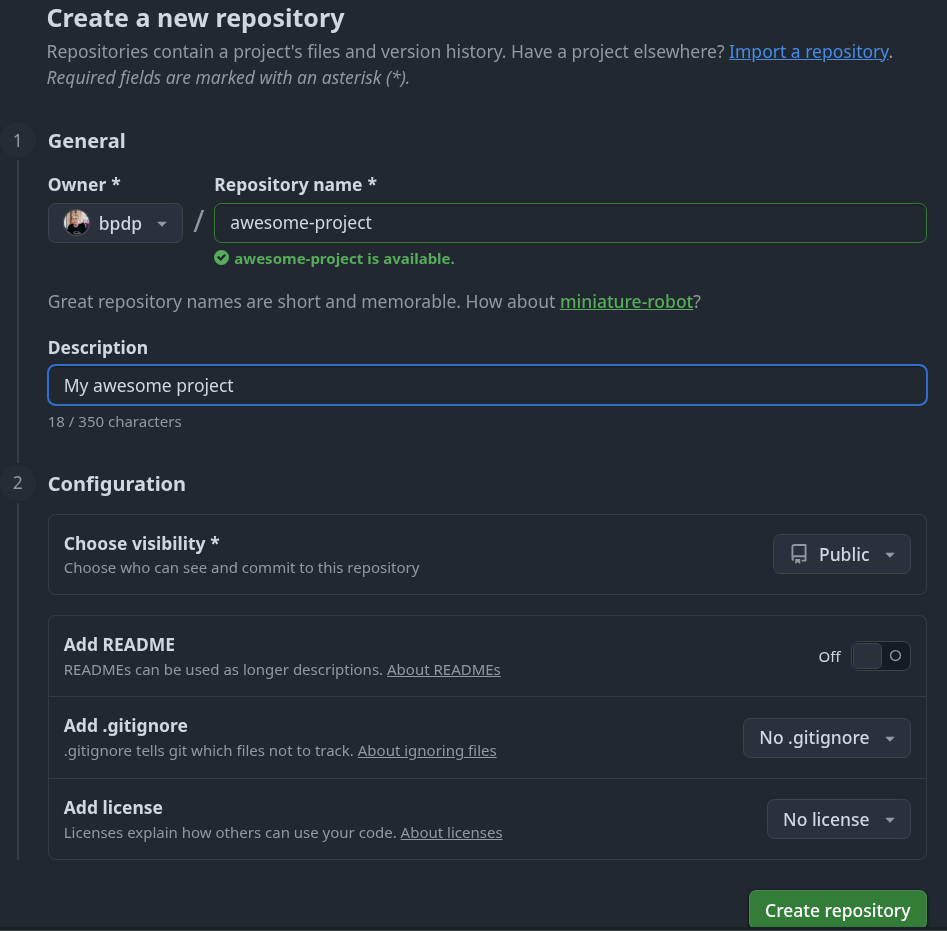
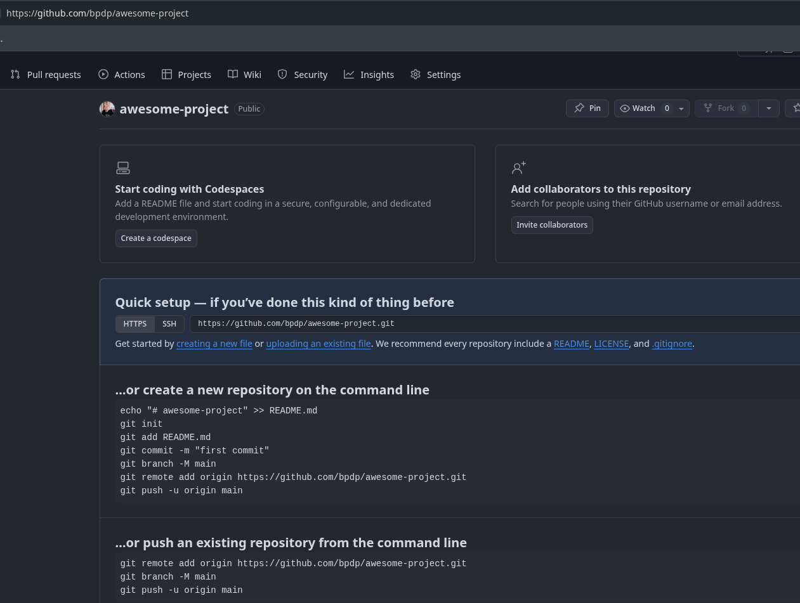
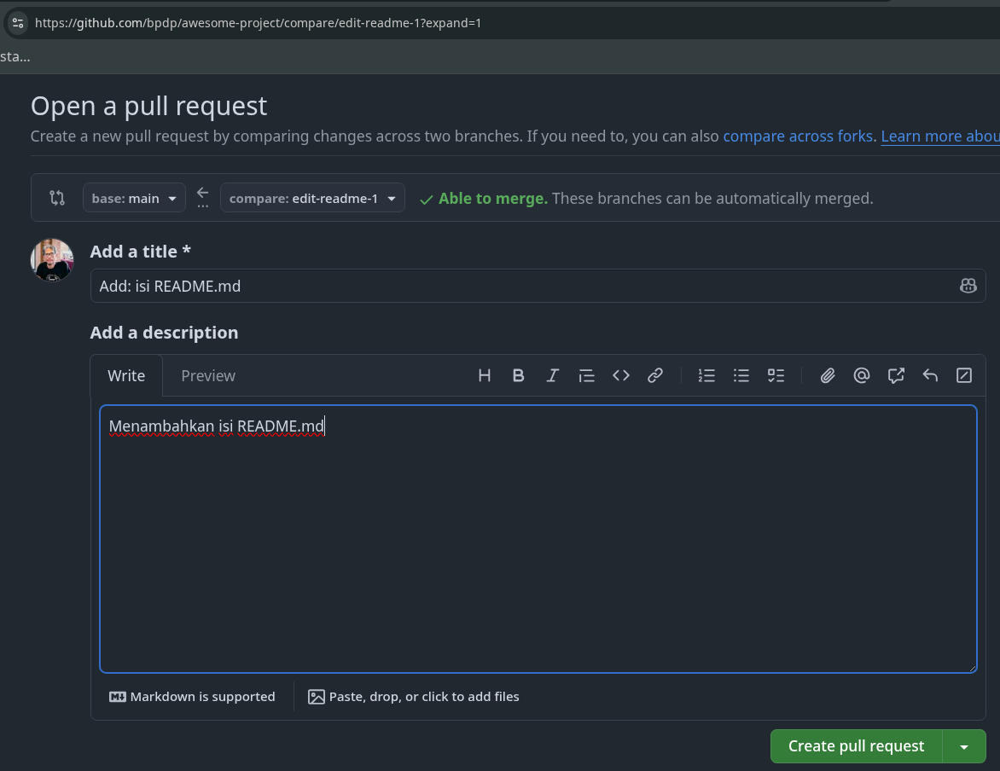
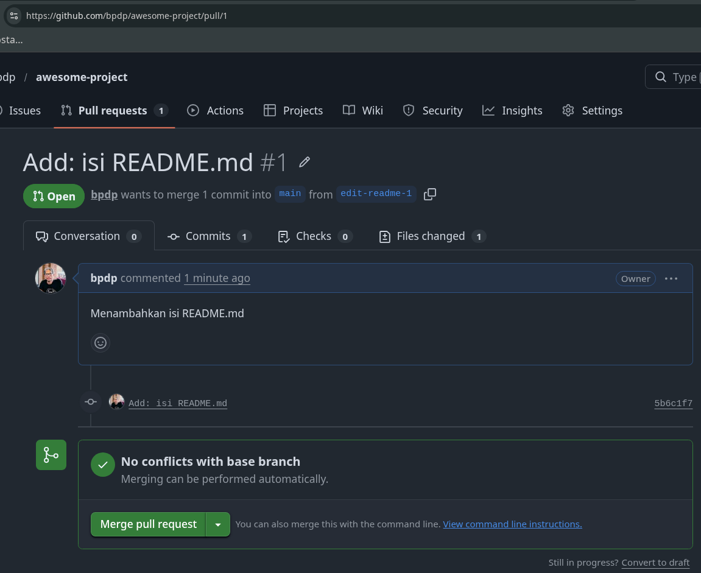
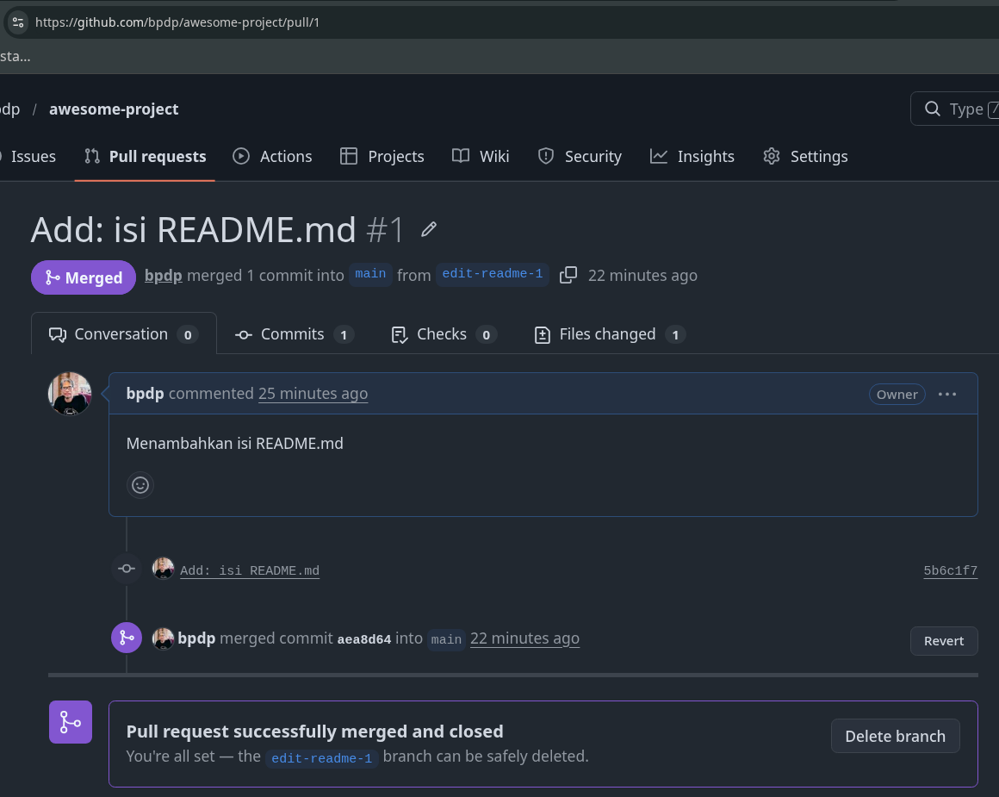

# Mengelola Repo Sendiri di Account Sendiri

[ [Kembali](README.md) ]

Bagian ini merupakan seri tulisan tentang [Git](https://git-scm.com/). Silahkan ke [README.md](README.md) untuk memahami gambaran garis besar materi-materi yang dituliskan.

## *Personal Access Token*

Pada [bulan Juli 2020](https://github.blog/2020-07-30-token-authentication-requirements-for-api-and-git-operations/), GitHub mengumumkan tentang penggunaan *token-based authentication*. Mulai 13 Agustus 2021, penggunaan token merupakan [kewajiban untuk semua akses ke GitHub yang memerlukan otentikasi](https://github.blog/2020-12-15-token-authentication-requirements-for-git-operations/), sehingga para pengguna GitHub **wajib** mengaktifkan *personal access token*. Materi GitHub yang ada pada keseluruhan materi GitHub di repo ini memerlukan akses repo dari *command line* / *shell*, sehingga wajib menggunakan token. Gunakan [petunjuk dari GitHub](https://docs.github.com/en/authentication/keeping-your-account-and-data-secure/creating-a-personal-access-token) untuk membuat dan mengaktifkan *personal access token*.

## Langkah-langkah

Setiap orang yang telah mempunyai account di GitHub bisa membuat repo. Secara umum, langkah-langkahnya adalah sebagai berikut:

1. Buat repo kosong di GitHub, bisa *public* maupun *private*.
2. Clone repo kosong tersebut di komputer lokal
3. Perintah berikutnya terkait dengan perubahan repo serta sinkronisasi antara GitHub dengan lokal.

## Membuat Repo

Untuk membuat repo, gunakan langkah-langkan berikut:

1.  Klik tanda **+** pada bagian atas setelah login, pilih **New repository**



2.  Isikan nama, keterangan, serta lisensi. Jika dikehendaki, bisa membuat repo **Private**



3. Klik `Create Repository`

Setelah langkah-langkah tersebut, repo akan dibuat dan bisa diakses menggunakan pola `https://github.com/username/reponame` (`reponame` adalah nama yang anda isikan, pada konteks ini adalah `awesome-project`). Pada repo tersebut, akan muncul file LICENSE jika memilih mengaktifkan lisensi tertentu. Jika memilih membuat README pada saat langkah ke 2, juga akan muncul README.md. Ada atau tidak ada README.md tidak mempunyai efek apapun pada langkah ini. Untuk mempermudah, kosongkan saja semua pilihan, kita akan membuat itu semua dengan proses-proses pengisian di GitHub. File `.gitignore` akan berisi daftar file-file yang tidak akan dimasukkan ke repo saat kita melakukan proses *push*. Daftar file yang ada di `.gitignore` tersebut biasanya sesuai dengan konten dari repo (misalnya proyek yang akan kita buat adalah proyek Rust, maka kita bisa memilih khusus untuk Rust - file-file apa saja yang tidak akan di-*push*). Daftar file tersebut nanti bisa kita edit lagi dengan mengedit file `.gitignore`.

Setelah selesai mengisi dan klik pada `Create Repository`, GitHub akan membuat repo kita sesuai dengan isian yang kita isikan dan kemudian akan menampilkan langsung isi dari repo kita. Jika kita memilih kondisi default (tanpa README, .gitignoe, LICENSE), maka repo kita akan kosong dan GitHub akan menampilkan info berikut:



## Clone Repo

Proses `clone` adalah proses untuk menduplikasikan remote repo di GitHub ke komputer lokal. Untuk melakukan proses `clone`, gunakan perintah berikut:

```bash
$ git clone https://github.com/bpdp/awesome-project
Cloning into 'awesome-project'...
warning: You appear to have cloned an empty repository.
$ tree awesome-project/
awesome-project/

0 directories, 0 files
$
```

**Catatan**: jika repo yang akan di-*clone* masih kosong, akan muncul peringatan bahwa repo tersebut kosong. Dalam kasus seperti ini, biarkan saja, tidak masalah.

Setelah perintah ini, di direktori `awesome-project` akan disimpan isi repo yang sama dengan di GitHub. Perbedaannya, di komputer lokal terdapat direktori `.git` yang digunakan secara internal oleh Git. 

```bash
$ cd awesome-project
$ ls -la
total 0
drwxr-xr-x 3 bpdp bpdp  18 Mar 24 06:50 .
drwxr-xr-x 3 bpdp bpdp  29 Mar 24 06:50 ..
drwxr-xr-x 6 bpdp bpdp 103 Mar 24 06:50 .git
$ tree .git/
.git/
├── config
├── description
├── HEAD
├── hooks
│   ├── applypatch-msg.sample
│   ├── commit-msg.sample
│   ├── fsmonitor-watchman.sample
│   ├── post-update.sample
│   ├── pre-applypatch.sample
│   ├── pre-commit.sample
│   ├── pre-merge-commit.sample
│   ├── prepare-commit-msg.sample
│   ├── pre-push.sample
│   ├── pre-rebase.sample
│   ├── pre-receive.sample
│   ├── push-to-checkout.sample
│   ├── sendemail-validate.sample
│   └── update.sample
├── info
│   └── exclude
├── objects
│   ├── info
│   └── pack
└── refs
    ├── heads
    └── tags

9 directories, 18 files
$
```

Setiap repo Git akan mempunyai *branch* atau cabang, jadi untuk setiap repo kita bisa mempunyai 1 *branch* utama (master/main) dan berbagai perubahan terhadap isi repo utama tersebut (disebut dengan *branch*). Pada awalnya, GitHub menggunakan istilah *master* untuk *branch* utama dan merupakan *branch* yang otomatis dibuat saat membuat repo di GitHub. Saat ini terjadi perubahan istilah menjadi **main**, bukan lagi **master**. Oleh karena itu, perlu dibuat perubahan setelah membuat repo karena Git lokal masih menggunakan istilah **master**. Cara melakukan perubahan:

```bash
$ cd awesome-project
$ git branch -m main
$
```

**Catatan**: tidak semua repo melakukan perubahan ini. Pengubahan *master* ke *main* hanya merupakan kesepakatan saja dan bukan merupakan kewajiban.

## Mengelola Repo

Setelah `clone` ke komputer lokal, semua manipulasi konten dilakukan di komputer lokal dan hasilnya akan di-*push* ke remote repo di GitHub. Dengan demikian, jangan berganti-ganti remote lokal, sekali dibuat disitu, tetap berada disitu. Jika kehilangan repo lokal, clone ulang ke direktori yang bersih (kosong) setelah itu baru lakukan pengelolaan repo. Beberapa hal yang biasanya dilakukan akan diuraikan berikut ini.

### Mengubah Isi - Push Tanpa Branching dan Merging

Perubahan isi bisa terjadi karena satu atau kombinasi beberapa hal berikut:
1. File dihapus
2. File diedit
3. Membuat file / direktori baru
4. Menghapus direktori

Untuk kasus-kasus tersebut, lakukan perubahan di komputer lokal, setelah itu push ke repo. 

> **Catatan Penting**
> Untuk operasi edit file di repo ini, digunakan **vim**. Vim adalah editor teks yang biasanya 
> di-install secara default di Linux / BSD, tetapi tidak di Windows. Untuk mengikuti materi di repo ini,
> anda tidak harus menggunakan Vim tetapi bisa menggunakan editor teks lain yang menghasilkan file
> ASCII murni / file teks biasa. Contoh, jika anda menggunakan Windows adalah TextPad, NotePad++.
> dan lain-lain
>
> **cat** merupakan perintah di Linux untuk melihat isi dari suatu file. Jika di Windows, bisa menggunakan
> perintah **type namafile**. Penggunaan **cat** disini hanya untuk menunjukkan isi dari file, sehingga 
> anda mempunyai panduan isi dari file. Gunakan editor teks anda sendiri untuk membuat isi file tersebut.


```bash
$ vim README.md
$ cat README.md
# My Awesome Project

$ git status
On branch main

No commits yet

Untracked files:
  (use "git add <file>..." to include in what will be committed)
        README.md

nothing added to commit but untracked files present (use "git add" to track)
$ git add -A
$ git commit -m "Add: README.md"
[main (root-commit) acd9564] Add: README.md
 1 file changed, 2 insertions(+)
 create mode 100644 README.md
$ git push origin main
Username for 'https://github.com': bpdp
Password for 'https://bpdp@github.com':
Enumerating objects: 3, done.
Counting objects: 100% (3/3), done.
Writing objects: 100% (3/3), 252 bytes | 252.00 KiB/s, done.
Total 3 (delta 0), reused 0 (delta 0), pack-reused 0 (from 0)
To https://github.com/bpdp/awesome-project
 * [new branch]      main -> main
$
```

Berikut ini adalah penjelasan perintah-perintah yang digunakan di atas:

1. `git add -A`: digunakan untuk menandai semua (A = All) perubahan yang telah dilakukan ke dalam *staging area* yaitu tempat sementara untuk menyimpan semua hasil perubahan yang akan dijadikan permanen.
2. `git commit -m "Add: README.md"`: memasukkan semua perubahan yang telah ditandai untuk permanen ke *staging area*.
3. `git push origin maini`: mengirimkan (*push) semua perubahan yang telah dipermanenkan di *staging area* ke remote repo.

Cara ini lebih mudah tetapi mempunyai resiko jika terjadi kesalahan dalam edit. Cara yang lebih aman tetapi memerlukan langkah yang lebih panjang adalah `branching and merging`.

### Mengubah Isi dengan Branching and Merging

Dengan menggunakan cara ini, setiap kali akan melakukan perubaham, perubahan itu dilakukan di komputer lokal dengan membuat suatu *cabang* yang nantinya digunakan untuk menampung perubahan-perubahan tersebut. Setelah itu, cabang itu yang akan dikirim ke repo GitHub untuk dimintai review kemudian digabungkan (`merge`) ke main. Secara umum, repo yang dibuat biasanya sudah mempunyai satu branch yang disebut dengan `main`. Cara ini lebih aman, terstruktur, terkendali, dan mempunyai *history* yang lebih baik. Jika perubahan yang kita buat sudah terlalu kacau dan kita menyesal, maka ada cara untuk "membersihkan" repo lokal kita. Secara umum, langkahnya adalah sebagai berikut:

1. Buat *branch* untuk menampung perubahan-perubahan (*git branch -b nama-branch*)
2. Lakukan perubahan-perubahan
3. *Add* dan *commit* perubahan-perubahan tersebut ke *branch*
4. Kembali ke repo main
5. *Push branch* ke repo di GitHub (sering disebut *origin*) dengan perintah *git push origin nama-branch*. Untuk mengetahui URL dari *remote origin*, kita bisa menggunakan *git remote* kemudian melihat isi dari `.git/config`.
5. Buat *pull request* di GitHub
6. *Merge pull request* di GitHub
7. *Merge branch* untuk menampung perubahan-perubahan tersebut ke main (dilakukan di lokal).
8. Selesai.

Berikut adalah gambarannya:

```bash
$ git checkout -b edit-readme-1
Switched to a new branch 'edit-readme-1'
$ vim README.md
$ cat README.md
# My Awesome Project

Ini isi proyek
$ git status
On branch edit-readme-1
Changes not staged for commit:
  (use "git add <file>..." to update what will be committed)
  (use "git restore <file>..." to discard changes in working directory)
        modified:   README.md

no changes added to commit (use "git add" and/or "git commit -a")
$ git add -A
$ git commit -m "Add: isi README.md"
[edit-readme-1 5b6c1f7] Add: isi README.md
 1 file changed, 1 insertion(+)
$ git checkout main
Switched to branch 'main'
Your branch is up to date with 'origin/main'.
$ git remote
origin
$ cat .git/config
[core]
        repositoryformatversion = 0
        filemode = true
        bare = false
        logallrefupdates = true
[remote "origin"]
        url = https://github.com/bpdp/awesome-project
        fetch = +refs/heads/*:refs/remotes/origin/*
[branch "main"]
        remote = origin
        merge = refs/heads/main
$ git push origin edit-readme-1
Username for 'https://github.com': bpdp
Password for 'https://bpdp@github.com':
Enumerating objects: 5, done.
Counting objects: 100% (5/5), done.
Writing objects: 100% (3/3), 298 bytes | 298.00 KiB/s, done.
Total 3 (delta 0), reused 0 (delta 0), pack-reused 0 (from 0)
remote:
remote: Create a pull request for 'edit-readme-1' on GitHub by visiting:
remote:      https://github.com/bpdp/awesome-project/pull/new/edit-readme-1
remote:
To https://github.com/bpdp/awesome-project
 * [new branch]      edit-readme-1 -> edit-readme-1
$
```

Setelah itu, kirim *pull request (PR)* dengan mengakses URL seperti yang telah ditampilkan pada pesan *push* di atas (https://github.com/bpdp/awesome-project/pull/new/edit-readme-1). Isikan pesan dari PR dan klik pada **Create pull request**:



Setelah membuat PR, PR tersebut bisa di-merge. Perhatikan, jika muncul "No conflict with base branch" maka PR tersebut aman untuk di-*merge*.



Setelah itu, `Confirm Merge`, branch yang kita kirimkan tadi sudah dimasukkan ke branch `main`. Setelah itu, merge di komputer lokal (*git merge nama-branch*). Setelah proses *merge* di komputer lokal, branch tersebut bisa saja tetap ada di situ (untuk catatan saja) atau akan kita hapus. Dalam konteks ini, branch edit-readme-1 tersebut akan kita hapus menggunakan perintah `git branch -D`. Setelah itu kita sinkronisasi dengan remote di GitHub dengan perintah `git pull`:

```bash
$ git merge edit-readme-1
Updating acd9564..5b6c1f7
Fast-forward
 README.md | 1 +
 1 file changed, 1 insertion(+)
$ git branch -D edit-readme-1
Deleted branch edit-readme-1 (was 5b6c1f7).
$ git branch
* main
$ git pull
remote: Enumerating objects: 1, done.
remote: Counting objects: 100% (1/1), done.
remote: Total 1 (delta 0), reused 0 (delta 0), pack-reused 0 (from 0)
Unpacking objects: 100% (1/1), 908 bytes | 908.00 KiB/s, done.
From https://github.com/bpdp/awesome-project
   acd9564..aea8d64  main       -> origin/main
Updating 5b6c1f7..aea8d64
Fast-forward
bpdp@NEO-X ~/tmp/gembus/awesome-project (main)
$
```

Pada pesan sukses *merge* di GitHub, kita bisa menghapus *branch* yang telah kita *merge* tersebut dengan meng-klik pada **Delete branch**:



### Sinkronisasi

Suatu saat, bisa saja terjadi kita menggunakan komputer lain dan mengedit repo melalui repo lokal di komputer lain, setelah itu pindah ke kamputer lain lagi. Saat itu, kita perlu melakukan sinkronisasi ke kemputer lokal. Perintah untuk sinkronisasi adalah:

```
$ git pull
```

Perintah ini dikerjakan di direktori tempat repo lokal kita berada.

### Membatalkan Perubahan

Praktik yang baik adalah membuat *branch* pada saat kita akan melakukan perubahan-perubahan. Jika perubahan-perubahan yang kita lakukan sudah sedemikian kacaunya, maka kita bisa membuat supaya perubahan-perubahan yang kacau tersebut hilang dan kembali ke kondisi bersih seperti semula.

```bash
$ git checkout -b edit-readme-2
Switched to a new branch 'edit-readme-2'
$ git branch
* edit-readme-2
  main
$ vim README.md
$ git checkout main
M       README.md
Switched to branch 'main'
Your branch is up to date with 'origin/main'.
$ cat README.md
# My Awesome Project

Ini isi proyek. Jadi agak kacau nih
$ git branch -D edit-readme-2
Deleted branch edit-readme-2 (was aea8d64).
$ cat README.md
# My Awesome Project

Ini isi proyek. Jadi agak kacau nih
$ git reset --hard
HEAD is now at aea8d64 Merge pull request #1 from bpdp/edit-readme-1
$ cat README.md
# My Awesome Project

Ini isi proyek
$
```

### Undo Commit Terakhir

Suatu saat, mungkin kita sudah terlanjur mem-*push* perubahan ke repo GitHub tanpa melalui *branching and merging*, setelah itu kita baru menyadari bahwa perubahan tersebut salah. Untuk itu, kita bisa melakukan `git revert`. 

Jika kita melakukan proses *branching and merging*, maka yang perlu kita lakukan hanya membuka URL tempat merge kita lakukan dan kemudian klik pada *revert* setelah itu membuat PR untuk proses *revert* dengan mengikuti langkah-langkah di GitHub. 


Kondisi akan lebih rumit jika kita tidak menggunakan *branch and merging*. Berikut adalah langkah-langkahnya. Pada contoh ini, kita melakukan 2 kali perubahan dan masing-masing perubahan tersebut sudah kita *push* ke GitHub tanpa *branching and merging*.

```bash
$ cat README.md
# My Awesome Project

Ini isi proyek
$ git log --oneline
aea8d64 (HEAD -> main, origin/main, origin/HEAD) Merge pull request #1 from bpdp/edit-readme-1
5b6c1f7 (origin/edit-readme-1) Add: isi README.md
acd9564 Add: README.md
$ vim README.md
$ cat README.md 
# My Awesome Project

Ini isi proyeka

Ini isi 1
$ git commit -m "Add: contents"
[main 044b8de] Add: contents
 1 file changed, 3 insertions(+), 1 deletion(-)
$ git push origin main
Username for 'https://github.com': bpdp
Password for 'https://bpdp@github.com': 
Enumerating objects: 5, done.
Counting objects: 100% (5/5), done.
Writing objects: 100% (3/3), 298 bytes | 298.00 KiB/s, done.
Total 3 (delta 0), reused 0 (delta 0), pack-reused 0 (from 0)
To https://github.com/bpdp/awesome-project
   aea8d64..044b8de  main -> main
$ vim README.md
$ cat README.md 
# My Awesome Project

Ini isi proyeka

Ini isi 1

Ini isi 2
$ git add -A
$ git commit -m "Add: contents - 2"
[main d5dfd14] Add: contents - 2
 1 file changed, 2 insertions(+)
$ git push origin main
Username for 'https://github.com': bpdp
Password for 'https://bpdp@github.com': 
Enumerating objects: 5, done.
Counting objects: 100% (5/5), done.
Delta compression using up to 12 threads
Compressing objects: 100% (2/2), done.
Writing objects: 100% (3/3), 302 bytes | 302.00 KiB/s, done.
Total 3 (delta 0), reused 0 (delta 0), pack-reused 0 (from 0)
To https://github.com/bpdp/awesome-project
   044b8de..d5dfd14  main -> main
$ git status
On branch main
Your branch is up to date with 'origin/main'.

nothing to commit, working tree clean
$ 
```

Contoh di atas adalah contoh untuk mengubah README.md dengan beberapa (2) *commit* diikuti dengan *push* ke GitHub. Apa yang terjadi jika kita menyadari bahwa konten yang kita buat salah dan kita ingin mengembalikan ke kondisi awal? Langkah berikut ini akan mengembalikan ke posisi terakhir sebelum *commit* terakhir. Lakukan proses ini di lokal pada direktori repo yang akan kita kembalikan kontennya:


```bash
$ git revert HEAD
```

Perintah di atas akan membuka editor. Pada editor tersebut kita bisa mengetikkan pesan *revert* ( = pesan commit untuk pembatalan). Pesan default sudah cukup mewakili:

```
Revert "Add: contents - 2" 
 
This reverts commit d5dfd143df0dfbd307bae44b2416c97a8fcc7b62. 
 
# Please enter the commit message for your changes. Lines starting 
# with '#' will be ignored, and an empty message aborts the commit. 
# 
# On branch main 
# Your branch is up to date with 'origin/main'. 
# 
# Changes to be committed: 
#       modified:   README.md 
#
```

Setelah selesai, simpan:

```bash
$ git revert HEAD
[main d3f4d96] Revert "Add: contents - 2"
 1 file changed, 2 deletions(-)
$
```

Selanjutnya, tinggal di-*push* ke repo GitHub.

```bash
$ git status
On branch main
Your branch is ahead of 'origin/main' by 1 commit.
  (use "git push" to publish your local commits)

nothing to commit, working tree clean
$ git push origin main
Username for 'https://github.com': bpdp
Password for 'https://bpdp@github.com': 
Enumerating objects: 5, done.
Counting objects: 100% (5/5), done.
Delta compression using up to 12 threads
Compressing objects: 100% (1/1), done.
Writing objects: 100% (3/3), 329 bytes | 329.00 KiB/s, done.
Total 3 (delta 0), reused 0 (delta 0), pack-reused 0 (from 0)
To https://github.com/bpdp/awesome-project
   d5dfd14..d3f4d96  main -> main
$ cat README.md
# My Awesome Project

Ini isi proyeka

Ini isi 1

$
```

**Catatan**: sila periksa repo di GitHub, pembatalan telah dilakukan.

Ada kalanya, *commit* sudah dilakukan, tetapi belum di-*push* ke repo GitHub (masih berada di lokal), cara membatalkannya dengan menggunakan perintah `git reset --hard HEAD^`:

```bash
$ vim README.md
$ cat README.md
# My Awesome Project

Ini isi proyeka

Ini isi 1

Ini isi tambahan 1
$ git add -A
$ git commit -m "Add: isi tambahan 1"
[main 118d802] Add: isi tambahan 1
 1 file changed, 2 insertions(+)
$ git status
On branch main
Your branch is ahead of 'origin/main' by 1 commit.
  (use "git push" to publish your local commits)

nothing to commit, working tree clean
$ git log --oneline
118d802 (HEAD -> main) Add: isi tambahan 1
d3f4d96 (origin/main, origin/HEAD) Revert "Add: contents - 2"
d5dfd14 Add: contents - 2
044b8de Add: contents
aea8d64 Merge pull request #1 from bpdp/edit-readme-1
5b6c1f7 (origin/edit-readme-1) Add: isi README.md
acd9564 Add: README.md
$ git reset --hard HEAD^
HEAD is now at d3f4d96 Revert "Add: contents - 2"
$ git status
On branch main
Your branch is up to date with 'origin/main'.

nothing to commit, working tree clean
$ cat README.md 
# My Awesome Project

Ini isi proyeka

Ini isi 1
$ 
```

Bagaimana jika kita akan melalukan pembatalan untuk perubahan yang sudah lama dilakukan (setelah perubahan tersebut, banyak perubahan-perubahan telah dilakukan)? Untuk kembali ke perubahan pada saat yang sudah lama, yang perlu dilakukan adalah melakukan `git revert <posisi>` kemudian mengedit secara manual kemudian *push* ke repo.

Berikut ini adalah log yang telah dilakukan dengan perubahan terakhir terjadi di paling atas:

```bash
$ git log --oneline
d3f4d96 (HEAD -> main, origin/main, origin/HEAD) Revert "Add: contents - 2"
d5dfd14 Add: contents - 2
044b8de Add: contents
aea8d64 Merge pull request #1 from bpdp/edit-readme-1
5b6c1f7 (origin/edit-readme-1) Add: isi README.md
acd9564 Add: README.md
bpdp@NEO-X ~/tmp/gembus/awesome-project (main)
$ 
```

Berikutnya, kita akan menambahkan 2 *push* ke repo GitHub (*push* pertama dengan pesan *commit* "Isi 2" dan isi perubahan pada README.md "Ini isi 2" dan push berikut dengan pesan *commit* "Isi 3" dan isi perubahan pada README.md "Ini isi 3"):

_Push "Isi 2"_

```bash
$ vim README.md 
$ cat README.md 
# My Awesome Project

Ini isi proyeka

Ini isi 1

Ini isi 2
$ git add -A
$ git commit -m "Isi 2"
[main 9478339] Isi 2
 1 file changed, 2 insertions(+)
$ git push origin main
Username for 'https://github.com': bpdp
Password for 'https://bpdp@github.com': 
Enumerating objects: 5, done.
Counting objects: 100% (5/5), done.
Delta compression using up to 12 threads
Compressing objects: 100% (2/2), done.
Writing objects: 100% (3/3), 295 bytes | 295.00 KiB/s, done.
Total 3 (delta 0), reused 0 (delta 0), pack-reused 0 (from 0)
To https://github.com/bpdp/awesome-project
   d3f4d96..9478339  main -> main
$ 

```

_Push "Isi 3"_ 

```bash
$ vim README.md 
$ cat README.md 
# My Awesome Project

Ini isi proyeka

Ini isi 1

Ini isi 2

Ini isi 3
$ git add -A
$ git commit -m "Isi 3"
[main 16398a0] Isi 3
 1 file changed, 2 insertions(+)
$ git push origin main
Username for 'https://github.com': bpdp
Password for 'https://bpdp@github.com': 
Enumerating objects: 5, done.
Counting objects: 100% (5/5), done.
Delta compression using up to 12 threads
Compressing objects: 100% (2/2), done.
Writing objects: 100% (3/3), 298 bytes | 298.00 KiB/s, done.
Total 3 (delta 0), reused 0 (delta 0), pack-reused 0 (from 0)
To https://github.com/bpdp/awesome-project
   9478339..16398a0  main -> main
$ 
```

Bagaimana jika setelah *push* terakhir (push "Isi 3"), kita menyadari bahwa push "Isi 2" ternyata keliru? Gunakan perintah `git revert <posisi>`.

```bash
$ git log --oneline
16398a0 (HEAD -> main, origin/main, origin/HEAD) Isi 3
9478339 Isi 2
d3f4d96 Revert "Add: contents - 2"
d5dfd14 Add: contents - 2
044b8de Add: contents
aea8d64 Merge pull request #1 from bpdp/edit-readme-1
5b6c1f7 (origin/edit-readme-1) Add: isi README.md
acd9564 Add: README.md
bpdp@NEO-X ~/tmp/gembus/awesome-project (main)
$ 
```

Dari log tersebut, kita mengetahui bahwa id untuk *push* "Isi 2" adalah 9478339. Angka tersebut yang akan kita gunakan saat `git revert <posisi>` dengan perintah `git revert <9478339>`. 

```bash
$ git revert 9478339
Auto-merging README.md
CONFLICT (content): Merge conflict in README.md
error: could not revert 9478339... Isi 2
hint: After resolving the conflicts, mark them with
hint: "git add/rm <pathspec>", then run
hint: "git revert --continue".
hint: You can instead skip this commit with "git revert --skip".
hint: To abort and get back to the state before "git revert",
hint: run "git revert --abort".
hint: Disable this message with "git config set advice.mergeConflict false"
bpdp@NEO-X ~/tmp/gembus/awesome-project (main|REVERTING)
$ 
```


```bash 


$ cat README.md
# My Awesome Project

Ini isi proyeka

Ini isi 1

Ini isi 2

Ini isi 3
$ git log --oneline
b14810f (HEAD -> main, origin/main, origin/HEAD) Add: isi 3
a7615fb Add: isi 2
f800ced Revert "Add: contents - 2"
fed7e79 Add: contents - 2
c55fd06 Add: contents
7e546b0 Merge pull request #1 from oldstager/edit-readme-1
032d079 (origin/edit-readme-1) Add: isi README.md
2ab2e28 Add: README.md
8dd68d4 Initial commit
$ git revert a7615fb
error: could not revert a7615fb... Add: isi 2
hint: after resolving the conflicts, mark the corrected paths
hint: with 'git add <paths>' or 'git rm <paths>'
hint: and commit the result with 'git commit'
$
```

Setelah itu, jika dilihat pada file, akan muncul tambahan untuk memudahkan meng-edit:

```bash 
$ cat README.md 
# My Awesome Project

Ini isi proyeka

Ini isi 1
<<<<<<< HEAD

Ini isi 2

Ini isi 3
=======
>>>>>>> parent of 9478339 (Isi 2)
$ 
```

Perubahan pada file tersebut harus di-*resolve* terlebih dahulu, setelah itu baru di-*add* dan *commit*. Edit file tersebut, setelah itu simpan.

```bash
$ cat README.md 
# My Awesome Project

Ini isi proyek

Ini isi 1

Ini isi 2 setelah revert

Ini isi 3
$ git status
On branch main
Your branch is up to date with 'origin/main'.

You are currently reverting commit 9478339.
  (fix conflicts and run "git revert --continue")
  (use "git revert --skip" to skip this patch)
  (use "git revert --abort" to cancel the revert operation)

Unmerged paths:
  (use "git restore --staged <file>..." to unstage)
  (use "git add <file>..." to mark resolution)
	both modified:   README.md

no changes added to commit (use "git add" and/or "git commit -a")
$ 
```

Setelah itu, lanjutkan proses revert. Saat `git revert --continue` isikan pesan *revert*.

```bash
$ git revert --continue
Revert "Isi 2"

This reverts commit 9478339c6394d8b9fe3e0c5e35feda659c278fb0.

# Conflicts:
#       README.md

# Please enter the commit message for your changes. Lines starting
# with '#' will be ignored, and an empty message aborts the commit.
#
# On branch main
# Your branch is up to date with 'origin/main'.
#
# You are currently reverting commit 9478339.
#
# Changes to be committed:
#       modified:   README.md
#
```

Setelah disimpan, akan ditampilkan pesan:

```bash
$ git revert --continue
[main 7d68802] Revert "Isi 2"
 1 file changed, 2 insertions(+), 2 deletions(-)
bpdp@NEO-X ~/tmp/gembus/awesome-project (main)
$ 
``` 

Posisi tersebut menunjukkan bahwa kita sudah melakukan proses untuk mengubah konten dan meneruskan proses *revert*. Tidak perlu *commit* secara eksplisit karena saat *revert* dan kemudian mengisikan pesan *revert* sudah merupakan proses untuk *commit*. Setelah itu *push* ke *remote origin*:

```bash 
$ git status
On branch main
Your branch is ahead of 'origin/main' by 1 commit.
  (use "git push" to publish your local commits)

nothing to commit, working tree clean
$ git push origin main 
Username for 'https://github.com': bpdp
Password for 'https://bpdp@github.com': 
Enumerating objects: 5, done.
Counting objects: 100% (5/5), done.
Delta compression using up to 12 threads
Compressing objects: 100% (2/2), done.
Writing objects: 100% (3/3), 357 bytes | 357.00 KiB/s, done.
Total 3 (delta 0), reused 0 (delta 0), pack-reused 0 (from 0)
To https://github.com/bpdp/awesome-project
   16398a0..7d68802  main -> main
$ 
```

Proses selesai. Jika melihat ke repo GitHub, isi README.md telah berubah.
