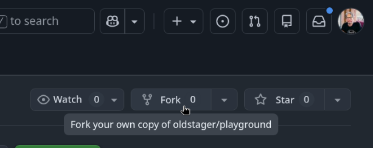
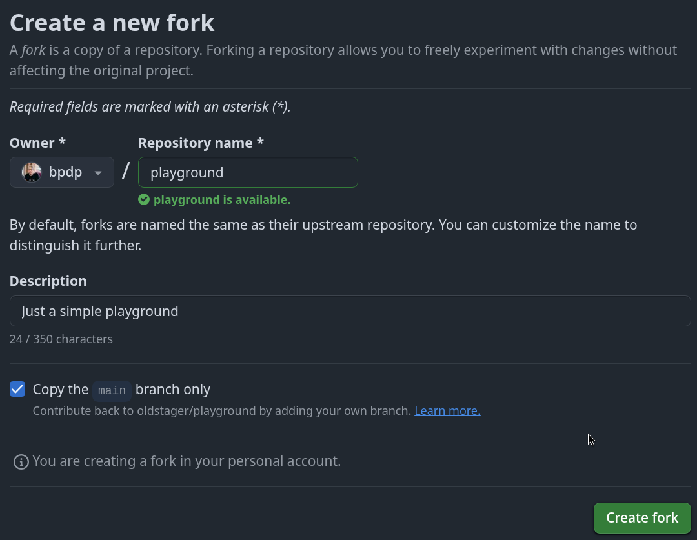
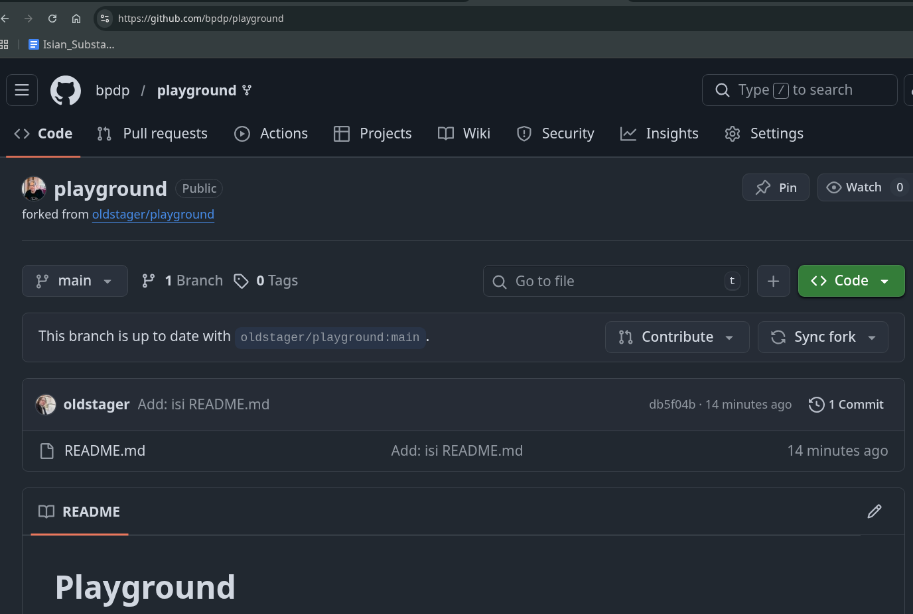
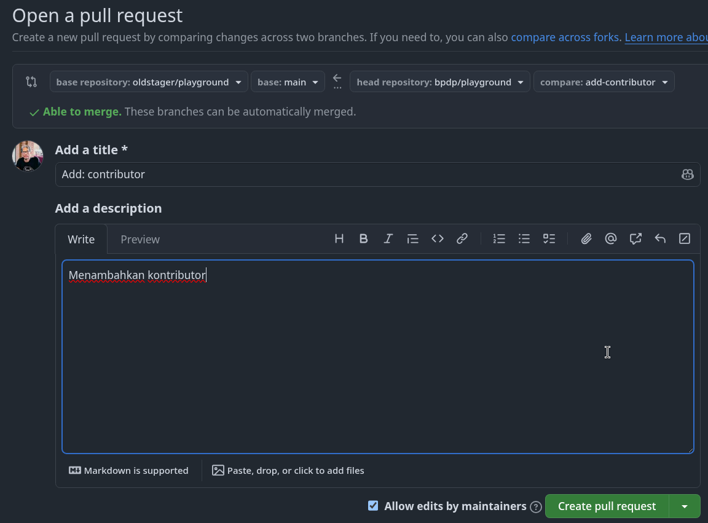
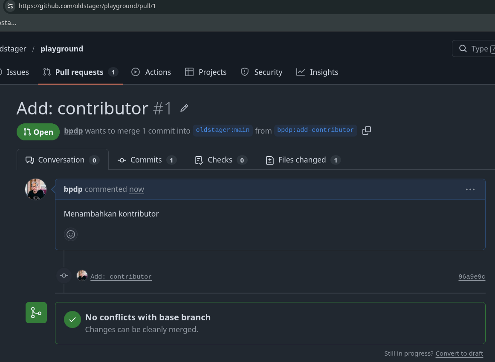

# Git untuk Kolaborasi

[ [Kembali](README.md) ]

Bagian ini merupakan seri tulisan tentang [Git](https://git-scm.com/). Silahkan ke [README.md](README.md) untuk memahami gambaran garis besar materi-materi yang dituliskan.

## Pendahuluan

Selain untuk mengelola aset digital milik diri sendiri, kita bisa menggunakan Git untuk berkolaborasi dalam suatu repo di GitHub yang bisa diakses bersama. Dalam kasus seperti ini, berarti ada 2 peran:

1. Pemilik repo, sering disebut sebagai *upstream author*.
2. Kontributor, yaitu orang-orang yang akan berkontribusi konten.

Untuk situasi seperti ini, diasumsikan:

1. *Upstream author* telah membuat repo git di GitHub
2. Kontributor telah mengetahui adanya repo tersebut, tertarik untuk berkontribusi, sudah mengetahui apa yang akan diberikan ke proyek (repo GitHub *upstream author*) tersebut.
3. Pembahasan selanjutnya adalah tentang bagaimana kontributor bisa mengirimkan kontribusi ke repo GitHub milik *upstream author*.

Dalam pembahasan ini:

1. *Upstream author* adalah *oldstager*.
2. Kontributor adalah *bpdp*
3. Repo dari *upstream author* adalah **playground** yang bisa diakses di [https://github.com/oldstager/playground](https://github.com/oldstager/playground)

Secara umum, berikut adalah langkah-langkah untuk berkontribusi pada suatu repo yang dimiliki oleh *upstream author*:

1. (Calon) kontributor melakukan proses *fork* repo dari *upstream author* ke *account* GitHub kontributor.
2. Kontributor melakukan proses *clone* hasil *fork* di repo kontributor ke komputer lokal.
3. Lakukan perubahan di lokal sesuai dengan apa yang akan dikontribusikan. Perubahan ini dilakukan dalam suatu *branch*.
4. *Push branch* yang berisi perubahan tersebut. Salah satu hasil dari *push* adalah URL untuk membuat PR.
5. Buat PR sesuai URL.
6. *Upstream author* akan melakukan *review* perubahan yang dilakukan sesuai dengan isi PR.
7. Jika *upstream author* setuju, maka akan dilakukan proses *merge*. Jika tidak, PR akan ditolak dan kontributor akan melakukan perubahan seperlunya jika masih ingin berkontribusi.

## Fork

*Fork* adalah membuat clone dari suatu repo di GitHub milik *upstream author*, diletakkan ke milik kontributor. *Fork* hanya dilakukan sekali saja. Pada dasarnya, proses untuk fork ini meliputi:

1. *Fork* repo di web GitHub.
2. Clone *fork* tersebut di komputer lokal.

Kontributor harus mem-*fork* repo *upstream author* sehingga di repo kontributor muncul repo tersebut. Proses *forking* ini dijelaskan dengan langkah-langkah berikut:

1. Login ke GitHub
2. Akses repo yang akan di-*fork*: https://github.com/oldstager/playground
3. Pada sisi kanan atas, klik Fork:



4. Pilih akan ditempatkan di account mana.



5. Setelah proses, repo dari *upstream author* sudah berada di account GitHub kita (kontributor)



Setelah proses tersebut, clone di komputer lokal:

```bash
$ git clone https://github.com/bpdp/playground
Cloning into 'playground'...
remote: Enumerating objects: 3, done.
remote: Counting objects: 100% (3/3), done.
remote: Total 3 (delta 0), reused 3 (delta 0), pack-reused 0 (from 0)
Receiving objects: 100% (3/3), done.
$ cd playground/
$ ls -la
total 4
drwxr-xr-x 3 bpdp bpdp  35 Mar 24 12:26 .
drwxr-xr-x 3 bpdp bpdp  24 Mar 24 12:26 ..
drwxr-xr-x 7 bpdp bpdp 147 Mar 24 12:26 .git
-rw-r--r-- 1 bpdp bpdp  14 Mar 24 12:26 README.md
bpdp@NEO-X ~/tmp/gembus/bpdp/playground (main)
$ 
```

Setelah itu, konfigurasikan repo lokal kontributor. Pada kondisi saat ini, di komputer lokal sudah terdapat repo `playground` yang berada pada direktori dengan nama yang sama. Untuk keperluan berkontribusi, ada 2 nama repo yang harus diatur:
  1. **origin**: menunjuk ke repo milik kontributor di GitHub, hasil dari *fork*.
  2. **upstream**: menunjuk ke repo milik *upstream author* (repo asli) di account *oldstager*.

Repo `origin` sudah dituliskan konfigurasinya pada saat melakukan proses clone dari repo kontributor. Konfigurasi repo *upstream* harus dibuat.

```bash
$ git remote -v
origin	https://github.com/bpdp/playground (fetch)
origin	https://github.com/bpdp/playground (push)
$ 
```

Tambahkan remote upstream:

```bash
$ git remote add upstream https://github.com/oldstager/playground.git
$ git remote -v
origin	https://github.com/bpdp/playground (fetch)
origin	https://github.com/bpdp/playground (push)
upstream	https://github.com/oldstager/playground.git (fetch)
upstream	https://github.com/oldstager/playground.git (push)
$ 
```

## Mengirimkan Pull Request 

Setiap kali melakukan perubahan, kirim perubahan tersebut. Pengiriman ini disebut dengan *Pull Request*. Pada posisi ini, kontributor bisa mengirimkan kontribusi dengan cara mengirimkan *pull request* (PR) ke *upstream author*. Setiap PR biasanya digunakan untuk satu kontribusi materi tertentu secara khusus. **Catatan**: jangan mengirimkan kontribusi satu PR berisi banyak materi, hal ini biasanya tidak akan disukai dan akan ditolak (kadang disertai kalimat yang tidak menyenangkan). Secara umum, langkah-langkahnya adalah sebagai berikut:

1. Kontributor akan bekerja di repo lokal (*create, update, delete* konten)
2. *Commit*
3. Push ke repo kontributor
4. Kirimkan PR ke repo *upstream author*.
5. *Upstream author* me-*review* dan kemudian menyetujui (*merge*) ke main atau menolak PR.
6. Jika disetujui dan di-*merge* ke repo main dari *upstream author*, sinkronkan repo di komputer lokal dan repo GitHub kontributor.

Berikut ini adalah contoh pengiriman perubahan isi README.md dengan menambahkan kontributor.

### Membuat Perubahan di Repo Lokal

Sebelum melakukan perubahan, pastikan:

1. Sudah ada koordinasi secara manual tentang perubahan-perubahan yang akan dilakukan.
2. Setelah melakukan perubahan-perubahan, pastikan bahwa isi repo lokal tersinkronisasi dengan repo dari *upstream author*.
3. Cara melakukan sinkronisasi (posisi sudah berada di direktori/repo lokal *playground*):

```bash
$ git fetch upstream 
From https://github.com/oldstager/playground
 * [new branch]      main       -> upstream/main
$ 
```

4. Lakukan perubahan-perubahan, setelah itu push ke **origin** (milik kontributor)

```bash
$ ls -la
total 4
drwxr-xr-x 3 bpdp bpdp  35 Mar 24 12:41 .
drwxr-xr-x 3 bpdp bpdp  24 Mar 24 12:41 ..
drwxr-xr-x 7 bpdp bpdp 147 Mar 24 12:41 .git
-rw-r--r-- 1 bpdp bpdp  14 Mar 24 12:41 README.md
$ git checkout -b add-contributor
Switched to a new branch 'add-contributor'
$ cat README.md 
# Playground

$ vim README.md 
$ cat README.md 
# Playground

## Contributor

1. [bpdp](https://github.com/bpdp)
$ git status
On branch add-contributor
Changes not staged for commit:
  (use "git add <file>..." to update what will be committed)
  (use "git restore <file>..." to discard changes in working directory)
	modified:   README.md

no changes added to commit (use "git add" and/or "git commit -a")
$ git add -A
$ git commit -m "Add: contributor"
[add-contributor 96a9e9c] Add: contributor
 1 file changed, 3 insertions(+)
$ git push origin add-contributor
Username for 'https://github.com': bpdp
Password for 'https://bpdp@github.com': 
Enumerating objects: 5, done.
Counting objects: 100% (5/5), done.
Delta compression using up to 12 threads
Compressing objects: 100% (2/2), done.
Writing objects: 100% (3/3), 323 bytes | 323.00 KiB/s, done.
Total 3 (delta 0), reused 0 (delta 0), pack-reused 0 (from 0)
remote: 
remote: Create a pull request for 'add-contributor' on GitHub by visiting:
remote:      https://github.com/bpdp/playground/pull/new/add-contributor
remote: 
To https://github.com/bpdp/playground
 * [new branch]      add-contributor -> add-contributor
$ 
```

5. Setelah itu, buka [halaman Web dari repo kontributor yang sudah disiapkan untuk PR](https://github.com/bpdp/playground/pull/new/add-contributor) sesuai dengan pesan saat dilakukan *push* di atas. Pada halaman tersebut akan ditampilkan isi yang kita push. 



6. Isikan deskripsi PR dan klik pada `Create pull request`, GitHub akan mengirimkan PR itu ke repo *upstream author*:



7. Pada repo *upstream author*, muncul angka 1 (artinya jumlahnya 1) pada `Pull requests` di bagian atas.
8. *Upstream author* bisa menyetujui setelah melakukan review: klik pada `Pull requests`, akan muncul PR dengan message seperti yang ditulis oleh kontributor (*Add: contributor*). Klik pada PR tersebut, review kemudian klik `Merge pull request` diikuti dengan `Confirm merge`. Setelah itu, status akan berubah menjadi `Merged`.
9. Sinkronkan semua repo (lokal maupun GitHub kontributor)

```bash
$ git checkout main
Switched to branch 'main'
Your branch is up to date with 'origin/main'.
$ git branch
  add-contributor
* main
$ git fetch upstream
remote: Enumerating objects: 1, done.
remote: Counting objects: 100% (1/1), done.
remote: Total 1 (delta 0), reused 0 (delta 0), pack-reused 0 (from 0)
Unpacking objects: 100% (1/1), 912 bytes | 912.00 KiB/s, done.
From https://github.com/oldstager/playground
 * [new branch]      main       -> upstream/main
$ cat README.md 
# Playground

$ git merge upstream/main
Updating db5f04b..dad2490
Fast-forward
 README.md | 3 +++
 1 file changed, 3 insertions(+)
$ cat README.md 
# Playground

## Contributor

1. [bpdp](https://github.com/bpdp)
$ git push origin main
Username for 'https://github.com': bpdp
Password for 'https://bpdp@github.com': 
Total 0 (delta 0), reused 0 (delta 0), pack-reused 0 (from 0)
To https://github.com/bpdp/playground
   db5f04b..dad2490  main -> main
$ git branch
  add-contributor
* main
$ git branch -D add-contributor
Deleted branch add-contributor (was 96a9e9c).
$ 
```

## Konflik

Ada kemungkinan, jika satu orang mengirimkan PR untuk satu atau lebih file dan sementara itu ada lainnya juga yang mengirimkan PR pada satu atau lebih file yang sama, maka akan terjadi konflik karena ada satu atau lebih file yang **sama** yang di-edit dan akan di-*merge*. Jika sampai terjadi kasus seperti ini, maka *upatream author* **harus** menolak semua PR dan kemudian masing-masing kontributor diharapkan menyelesaikan secara manual (offline) kemudian memutuskan siapa yang akan mengirimkan PR.
