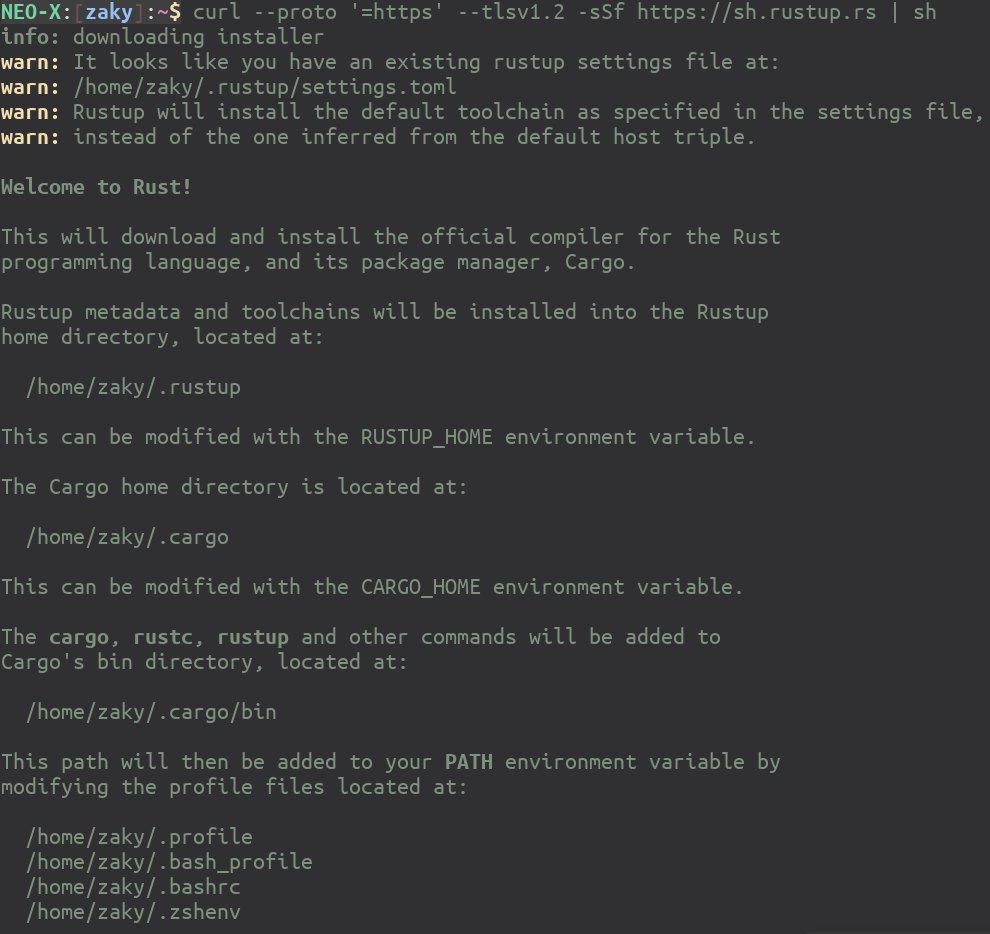
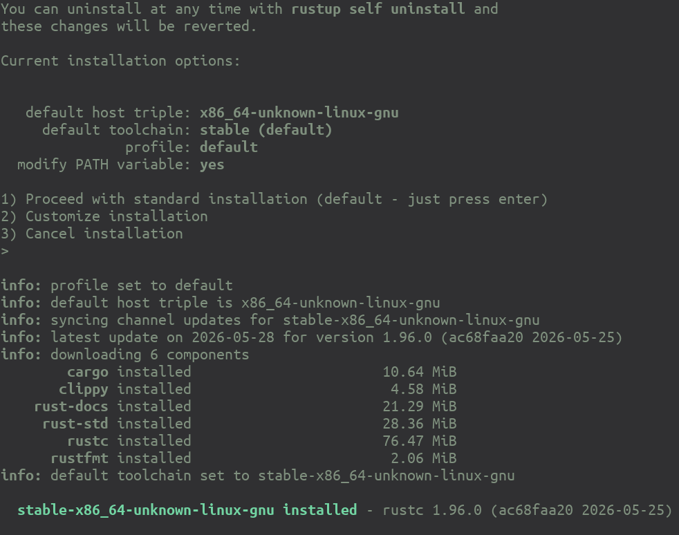
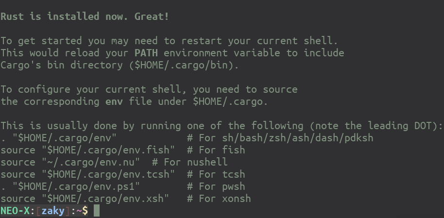
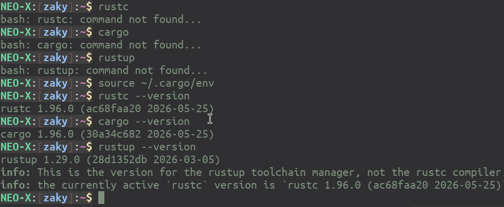
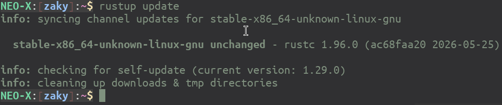

# Instalasi Rust 

Untuk instalasi Rust, tool resmi yang digunakan adalah [rustup](https://rustup.rs/). Secara default, *rustup* akan menginstall versi *stable*. Jika ingin menggunakan versi lainnya, gunakan *beta* dan *nightly*. Kedua versi tersebut tidak disarankan untuk developer yang akan membangun software dengan titik utama pada kestabilan. Berikut adalah langkah-langkah instalasi Rust menggunakan *rustup* (lihat: https://rust-lang.org/tools/install/):

```bash 
$ curl --proto '=https' --tlsv1.2 -sSf https://sh.rustup.rs | sh
```

Berikut adalah hasil dari perintah tersebut:





Instalasi juga akan menghasilkan file `$HOME/.cargo/env` yang harus di-*source* supaya lokasi instalasi dikenali di $PATH.



Setelah selesai intalasi, ada 2 hal yang sebaiknya diperhatikan:

1. Target
2. Komponen

**Target** adalah target CPU yang akan dihasilkan. Secara default, biasanya jika menggunakan prosesor berbasis Intel X86_64, biasanya target yang terinstall adalah **x86_64-unknown-linux-gnu**. Jika dikehendaki untuk bisa mengkompilasi ke arsitektur prosesor lain, gunakan perintah **rustup target list** untuk melihat arsitektur yang tersedia, kemudian **rustup target add <nama>** untuk menginstall target prosesor tertentu.

**Komponen** adalah komponen dari *Rust Compiler* yang akan kita install. Instalasi default akan menginstall *Rust Compiler*, *cargo* (*package manager*), *clippy* (*linter*), dokumentasi, *rust-std* (pustaka standar), *rustfmt* (*source code formatter*). Seperti halnya *target*, gunakan **rustup component list* untuk menampilkan komponen yang tersedia, **rustup component add <nama-komponen>** untuk menambahkan komponen. Contoh yang bagus untuk komponen ini adalah WASM untuk menghasilkan software Web Assembly, bisa diinstall menggunakan **rustup component add rust-std-wasm32-unknown-unknown**.

Untuk meng-*update* (termasuk semua komponen dan target - jika ada update):

```bash 
$ rustup update stable
```



Demikian proses instalasi Rust, happy hacking with Rust!
