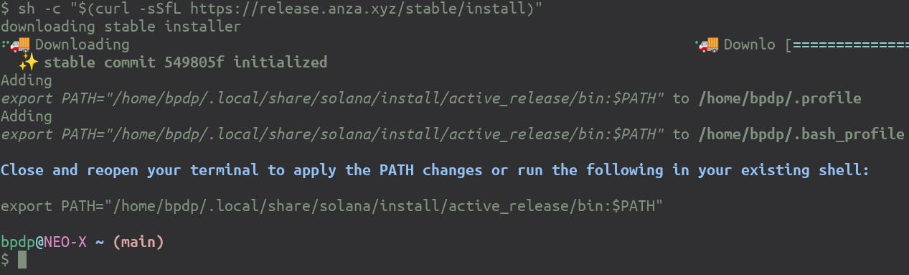
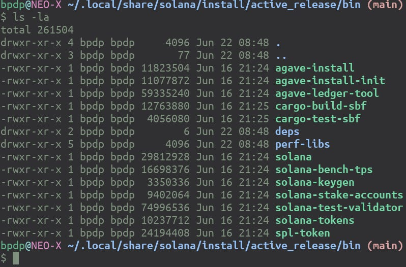
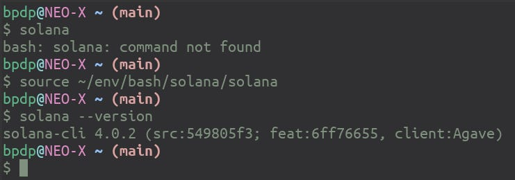
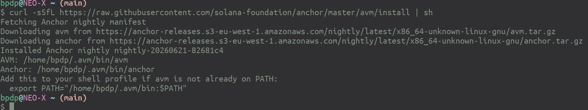
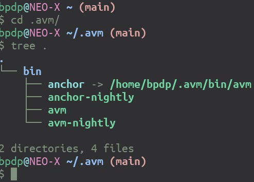
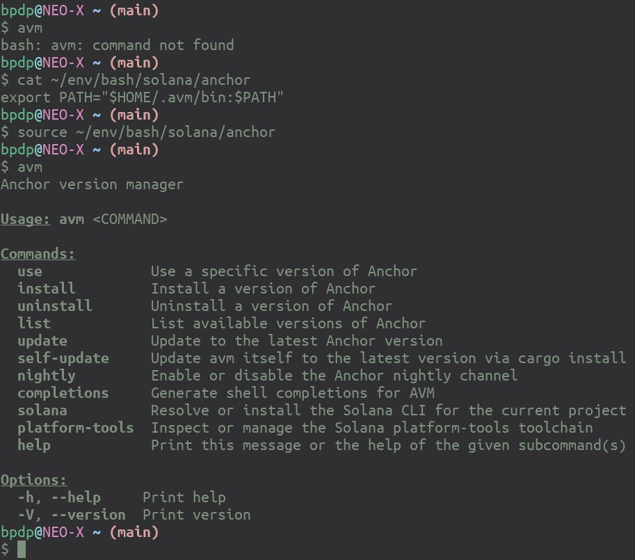
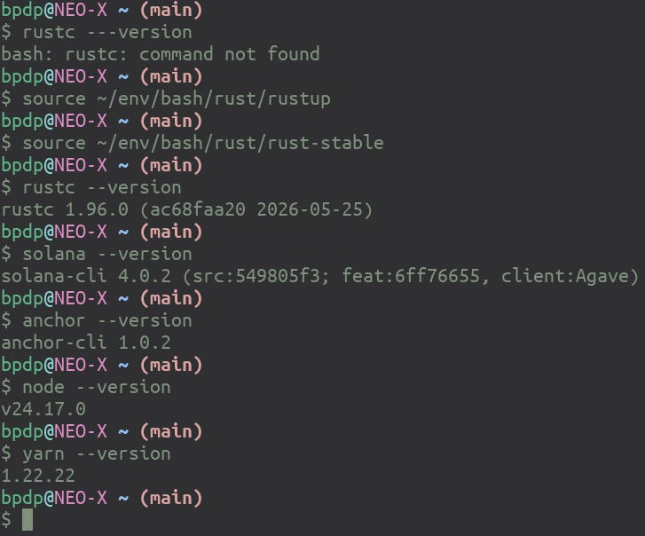
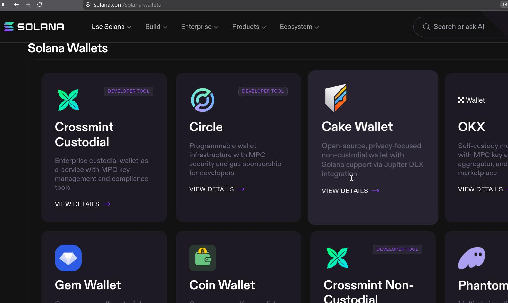
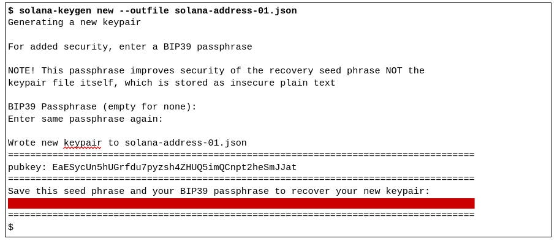
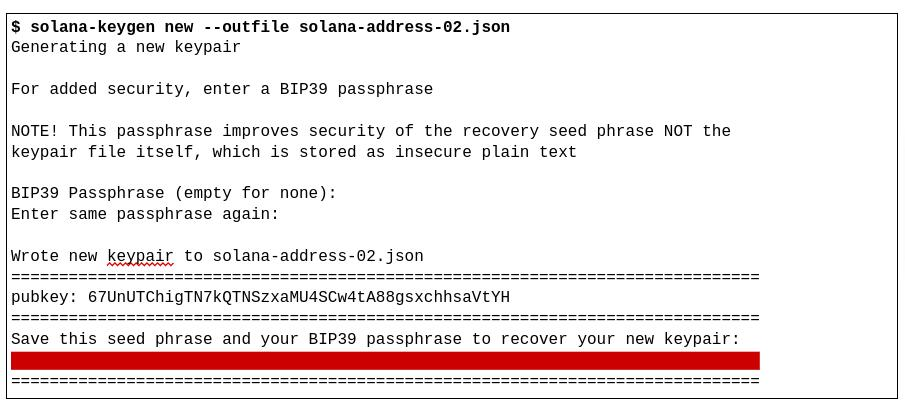

# Instalasi Peranti Pengembangan Solana 

Untuk mulai menggunakan Solana, kita akan melakukan instalasi software Solana, khususnya yang digunakan untuk pengembangan aplikasi. Beberapa prasyarat yang harus diinstall terlebih dahulu adalah:

1. [Rust](https://github.com/NEO-X-School/notes/blob/main/rust/install.md).
2. [Node.js dan Yarn](https://github.com/NEO-X-School/notes/blob/main/node.js/install.md).

Setelah itu, install peranti pengembangan Solana. Buat juga alamat wallet dari Solana. Langkah-langkahnya akan diberikan berikut ini.

```bash 
$ sh -c "$(curl -sSfL https://release.anza.xyz/stable/install)"
```





Buat file yang akan di-*source* pada setiap shell yang akan menggunakan *Solana CLI* (misal diletakkan di `$HOME/env/bash/solana/solana`):

```bash 
export PATH="/home/bpdp/.local/share/solana/install/active_release/bin:$PATH"
```



Solana juga mengembangkan framework untuk DApp berbasis Solana dengan nama Anchor (https://www.anchor-lang.com/docs - https://github.com/otter-sec/anchor). Install Anchor berikut ini:






Setelah proses instalasi tersebut, Anchor telah terinstall sesuai versi terakhir. Jika ingin mengubah versi, gunakan **avm**. Hasil akhir:



Untuk wallet, bisa menggunakan Metamask. Selain itu, jika menginginkan, bisa menggunakan berbagai wallet seperti yang ada pada URL https://solana.com/solana-wallets.



Berikut ini cara membuat address wallet Solana. Akan dibuat 2 address:



Catat BIP39 Passphrase yang digunakan serta seed phrase (ada di bagian bawah - diblok merah), jangan sampai hilang atau lupa dan jangan sampai diketahui orang lain. Address ke 2:



Berikut adalah alamat yang dihasilkan:

```bash
$ solana address -k solana-address-01.json
EaESy………………
$ solana address -k solana-address-02.json
67UnU………………
$
```

Demikian, happy hacking with Solana!
