# Agentic Engineering: Menggunakan AI-Assisted Zed untuk Membangun Software yang Lebih Baik 

| Penulis | Peran |
| -------- | ---------- |
| Dr. Bambang Purnomosidi D. P. | Penulis utama |

Update tarakhir: **15 Mei 2026**

Istilah [Agentic Engineering](https://zed.dev/agentic-engineering) dimunculkan oleh salah satu *founder* dari Zed, Nathan Sobo di [blog Zed](https://zed.dev/blog/software-craftsmanship-in-the-era-of-vibes). Tulisan ini kurang lebih berusaha untuk membuat *Agentic Engineering* menjadi lebih *practical* berdasarkan pengalaman dan referensi yang ada. 

*Agentic Engineering* didefinisikan sebagai proses perekayasaan untuk menggabungkan keahlian manusia dengan AI untuk membangun software yang lebih baik. Penulis sendiri pada dasarnya setuju dengan *agentic engineering* yang berada di tengah antara *AI skeptic* dan *full blown AI yang mengatakan AI akan menggantikan proses pembuatan software*. AI sebagai *tool* memang tidak bisa dihindari, tetapi juga tidak bisa "dilepaskan" 100%. Ada 2 hal utama yang membuat proses *agentic engineering* ini bisa berjalan dengan baik:
1. Tersedianya fasilitas untuk mengintegrasikan AI ke dalam IDE dengan manusia sebagai *first class citizen*.
2. Tersedianya fasilitas untuk kolaborasi antara manusia di dalam IDE tersebut.
Dua hal tersebut yang akan dibahas secara khusus dalam catatan ini.

## Instalasi Prasyarat

### Install Zed 

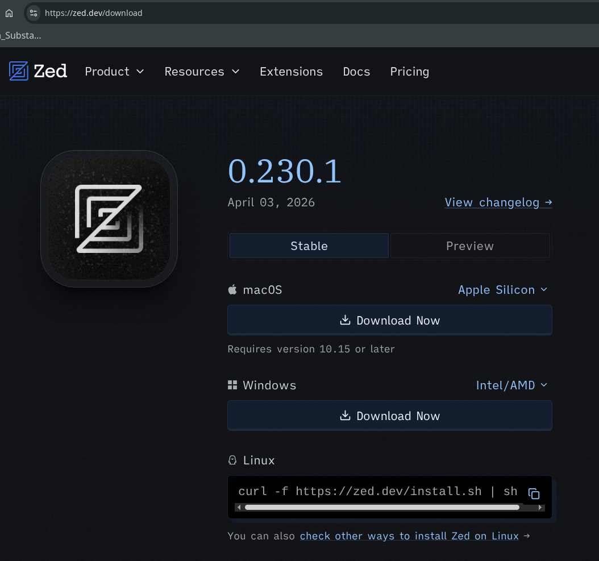

Akses ke https://zed.dev/download, setelah itu pilih sesuai dengan sistem operasi yang digunakan. Jika menggunakan Linux, Zed akan diinstall di *home directory* (`$HOME`) dan setiap dijalankan akan secara otomatis memeriksa rilis terbaru dan kemudian melakukan proses update jika terdapat versi baru. 

### Instalasi Ollama

```bash
$ curl -fsSL https://ollama.com/install.sh | sh
>>> Cleaning up old version at /usr/local/lib/ollama
[sudo] password for bpdp: 
>>> Installing ollama to /usr/local
>>> Downloading ollama-linux-amd64.tar.zst
######################################################################## 100.0%
>>> NVIDIA GPU installed.
>>> The Ollama API is now available at 127.0.0.1:11434.
>>> Install complete. Run "ollama" from the command line.
$
```

Instalasi akan dilakukan di `/usr/local/lib/ollama` dan `/usr/local/bin/`

```bash 
$ ls -la /usr/local/lib/ollama/
total 6488
drwxr-xr-x 5 root root    4096 May 13 16:31 .
drwxr-xr-x 3 root root    4096 May 13 16:19 ..
drwxr-xr-x 2 root root    4096 May 13 06:09 cuda_v12
drwxr-xr-x 2 root root    4096 May 13 05:48 cuda_v13
lrwxrwxrwx 1 root root      17 May 13 05:32 libggml-base.so -> libggml-base.so.0
lrwxrwxrwx 1 root root      21 May 13 05:32 libggml-base.so.0 -> libggml-base.so.0.0.0
-rwxr-xr-x 1 root root  748152 May 13 05:32 libggml-base.so.0.0.0
-rwxr-xr-x 1 root root  873912 May 13 05:32 libggml-cpu-alderlake.so
-rwxr-xr-x 1 root root  873912 May 13 05:32 libggml-cpu-haswell.so
-rwxr-xr-x 1 root root 1009080 May 13 05:32 libggml-cpu-icelake.so
-rwxr-xr-x 1 root root  820728 May 13 05:32 libggml-cpu-sandybridge.so
-rwxr-xr-x 1 root root 1009080 May 13 05:32 libggml-cpu-skylakex.so
-rwxr-xr-x 1 root root  636536 May 13 05:32 libggml-cpu-sse42.so
-rwxr-xr-x 1 root root  632472 May 13 05:32 libggml-cpu-x64.so
drwxr-xr-x 2 root root    4096 May 13 05:36 vulkan
$ ls -la /usr/local/bin/
total 43808
drwxr-xr-x  2 root root     4096 May 13 16:19 .
drwxr-xr-x 11 root root     4096 Feb 28 21:01 ..
-rwxr-xr-x  1 root root 44845312 May 13 05:31 ollama
$ 
```

Jika ingin meng-update Ollama, gunakan perintah instalasi di atas lagi. 

### Instalasi Model LLM 

Untuk aktivitas *coding*, pada dasarnya ada beberapa yang bisa digunakan. 

1. Instalasi lokal 

Cara ini digunakan jika kita mempunyai *resources* yang mencukupi. Sila mencari model yang sesuai dengan *resources* lokal yang dimiliki di [Ollama supported models](https://ollama.com/search).

**Catatan**: saat akan menggunakan model, pastikan bahwa jumlah parameter (sering ditulis dengan b - singkatan dari *billion* / milyar - menandakan jumlah parameter dari model tersebut). Jumlah model dan presisi menentukan kapabilitas dan menuntut VRAM yang sesuai. Sebagai gambaran, berikut adalah patokan dari VRAM yang diperlukan untuk jumlah parameter dan presisi:

| Ukuran Model | Presisi        | VRAM (dalam GB) |
| :----------: | :------------: | :-------------: |
| 7b-8b        | 16 bit (FP16)  | 14-16           |
| 7b-8b        | 4 bit (Q4_K_M) | 5-6             |
| 13b-14b      | 16 bit (FP16)  | 26-28           |
| 13b-14b      | 4 bit (Q4_K_M) | 9-10            |
| 30b-33b      | 4 bit (Q4_K_M) | 20-28           |
| 70b          | 4 bit (Q4_K_M) | 40-48           |

Untuk awal, kita akan menggunakan model [codellama](https://ollama.com/library/codellama).

```bash 
$ ollama run codellama
pulling manifest 
pulling 3a43f93b78ec: 100% ▕█████████████████████████████████████████████████████████████████████████████████████████████████████████████▏ 3.8 GB                         
pulling 8c17c2ebb0ea: 100% ▕█████████████████████████████████████████████████████████████████████████████████████████████████████████████▏ 7.0 KB                         
pulling 590d74a5569b: 100% ▕█████████████████████████████████████████████████████████████████████████████████████████████████████████████▏ 4.8 KB                         
pulling 2e0493f67d0c: 100% ▕█████████████████████████████████████████████████████████████████████████████████████████████████████████████▏   59 B                         
pulling 7f6a57943a88: 100% ▕█████████████████████████████████████████████████████████████████████████████████████████████████████████████▏  120 B                         
pulling 316526ac7323: 100% ▕█████████████████████████████████████████████████████████████████████████████████████████████████████████████▏  529 B                         
verifying sha256 digest 
writing manifest 
success 
>>> Send a message (/? for help)
```

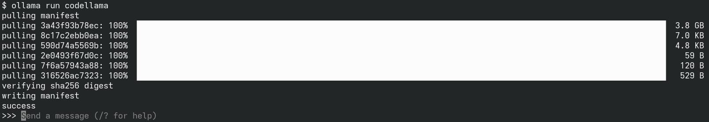

Untuk menguji:


Setelah proses di atas, model `codellama` sudah berada di lokal komputer kita, periksa dengan perintah berikut:

```bash
$ ollama serve
time=2026-05-13T17:17:43.491+07:00 level=INFO source=routes.go:1802 msg="server config" env="map[CUDA_VISIBLE_DEVICES: GGML_VK_VISIBLE_DEVICES: GPU_DEVICE_ORDINAL: HIP_VISIBLE_DEVICES: HSA_OVERRIDE_GFX_VERSION: HTTPS_PROXY: HTTP_PROXY: NO_PROXY: OLLAMA_CONTEXT_LENGTH:0 OLLAMA_DEBUG:INFO OLLAMA_DEBUG_LOG_REQUESTS:false OLLAMA_EDITOR: OLLAMA_FLASH_ATTENTION:false OLLAMA_GPU_OVERHEAD:0 OLLAMA_HOST:http://127.0.0.1:11434 OLLAMA_KEEP_ALIVE:5m0s OLLAMA_KV_CACHE_TYPE: OLLAMA_LLM_LIBRARY: OLLAMA_LOAD_TIMEOUT:5m0s OLLAMA_MAX_LOADED_MODELS:0 OLLAMA_MAX_QUEUE:512 OLLAMA_MAX_TRANSFER_STREAMS:4 OLLAMA_MODELS:/home/bpdp/.ollama/models OLLAMA_MULTIUSER_CACHE:false OLLAMA_NEW_ENGINE:false OLLAMA_NOHISTORY:false OLLAMA_NOPRUNE:false OLLAMA_NO_CLOUD:false OLLAMA_NUM_PARALLEL:1 OLLAMA_ORIGINS:[http://localhost https://localhost http://localhost:* https://localhost:* http://127.0.0.1 https://127.0.0.1 http://127.0.0.1:* https://127.0.0.1:* http://0.0.0.0 https://0.0.0.0 http://0.0.0.0:* https://0.0.0.0:* app://* file://* tauri://* vscode-webview://* vscode-file://*] OLLAMA_REMOTES:[ollama.com] OLLAMA_SCHED_SPREAD:false OLLAMA_VULKAN:false ROCR_VISIBLE_DEVICES: http_proxy: https_proxy: no_proxy:]"
time=2026-05-13T17:17:43.492+07:00 level=INFO source=routes.go:1804 msg="Ollama cloud disabled: false"
time=2026-05-13T17:17:43.492+07:00 level=INFO source=images.go:517 msg="total blobs: 11"
time=2026-05-13T17:17:43.492+07:00 level=INFO source=images.go:524 msg="total unused blobs removed: 0"
time=2026-05-13T17:17:43.492+07:00 level=INFO source=routes.go:1864 msg="Listening on 127.0.0.1:11434 (version 0.23.3)"
time=2026-05-13T17:17:43.493+07:00 level=INFO source=runner.go:67 msg="discovering available GPUs..."
time=2026-05-13T17:17:43.493+07:00 level=INFO source=server.go:433 msg="starting runner" cmd="/usr/local/bin/ollama runner --ollama-engine --port 33645"
time=2026-05-13T17:17:43.665+07:00 level=INFO source=server.go:433 msg="starting runner" cmd="/usr/local/bin/ollama runner --ollama-engine --port 43191"
time=2026-05-13T17:17:43.893+07:00 level=INFO source=runner.go:106 msg="experimental Vulkan support disabled.  To enable, set OLLAMA_VULKAN=1"
time=2026-05-13T17:17:43.893+07:00 level=INFO source=server.go:433 msg="starting runner" cmd="/usr/local/bin/ollama runner --ollama-engine --port 38191"
time=2026-05-13T17:17:43.893+07:00 level=INFO source=server.go:433 msg="starting runner" cmd="/usr/local/bin/ollama runner --ollama-engine --port 37783"
time=2026-05-13T17:17:43.951+07:00 level=INFO source=model_recommendations.go:177 msg="model recommendations cache sleep scheduled" wait=3h59m27.140918206s consecutive_failures=0
time=2026-05-13T17:17:44.123+07:00 level=INFO source=types.go:42 msg="inference compute" id=GPU-fc21007c-4634-492e-c993-6a12b208dce2 filter_id="" library=CUDA compute=8.6 name=CUDA0 description="NVIDIA GeForce RTX 2050" libdirs=ollama,cuda_v13 driver=13.2 pci_id=0000:01:00.0 type=discrete total="4.0 GiB" available="3.7 GiB"
time=2026-05-13T17:17:44.124+07:00 level=INFO source=routes.go:1914 msg="vram-based default context" total_vram="4.0 GiB" default_num_ctx=4096
```

Pada posisi tersebut, model `codellama` sudan terinstall di lokal komputer:

```bash
$ ollama list
NAME                ID              SIZE      MODIFIED   
codellama:latest    8fdf8f752f6e    3.8 GB    4 weeks ago  
$
```

Suatu saat, jika ingin mengupdate model, gunakan perintah *ollama pull <nama-model>*. Jika terdapat update, maka update akan diambil.

```bash
$ ollama pull codellama
pulling manifest 
pulling 3a43f93b78ec: 100% ▕█████████████████████████████████████████████████████████████████████████████████████████████████████████████▏ 3.8 GB                         
pulling 8c17c2ebb0ea: 100% ▕█████████████████████████████████████████████████████████████████████████████████████████████████████████████▏ 7.0 KB                         
pulling 590d74a5569b: 100% ▕█████████████████████████████████████████████████████████████████████████████████████████████████████████████▏ 4.8 KB                         
pulling 2e0493f67d0c: 100% ▕█████████████████████████████████████████████████████████████████████████████████████████████████████████████▏   59 B                         
pulling 7f6a57943a88: 100% ▕█████████████████████████████████████████████████████████████████████████████████████████████████████████████▏  120 B                         
pulling 316526ac7323: 100% ▕█████████████████████████████████████████████████████████████████████████████████████████████████████████████▏  529 B                         
verifying sha256 digest 
writing manifest 
success
$
```

Berikut adalah penambahan satu model lagi yaitu [gemma3:4b](https://ollama.com/library/gemma3). 

```bash
$ ollama pull gemma3:4b
pulling manifest 
pulling aeda25e63ebd: 100% ▕█████████████████████████████████████████████████████████████████████████████████████████████████████████████▏ 3.3 GB                         
pulling e0a42594d802: 100% ▕█████████████████████████████████████████████████████████████████████████████████████████████████████████████▏  358 B                         
pulling dd084c7d92a3: 100% ▕█████████████████████████████████████████████████████████████████████████████████████████████████████████████▏ 8.4 KB                         
pulling 3116c5225075: 100% ▕█████████████████████████████████████████████████████████████████████████████████████████████████████████████▏   77 B                         
pulling b6ae5839783f: 100% ▕█████████████████████████████████████████████████████████████████████████████████████████████████████████████▏  489 B                         
verifying sha256 digest 
writing manifest 
success 
$
```

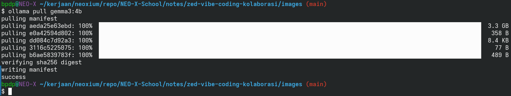

```bash
$ ollama list
NAME                ID              SIZE      MODIFIED      
gemma3:4b           a2af6cc3eb7f    3.3 GB    2 seconds ago    
codellama:latest    8fdf8f752f6e    3.8 GB    3 minutes ago
$
```

Zed secara default akan mengaktifkan AI. Jika akan menonaktifkan atau mengaktifkan AI, gunakan menu **Open Settings** - **AI** - **Disable AI**. Kita akan menggunakan AI, jadi pastikan bahwa **DIsable AI** dalam kondisi non-aktif. Pada semua kondisi (masuk Zed tanpa ada proyek terbuka, sudah ada proyek yang terbuka), secara default AI aktif dan window **Zed Agent** bisa dibuka menggunakan kombinasi tombol **Ctrl-B**. 

Untuk menggunakan AI, pilihan yang bisa digunakan banyak sekali. Secara default, Zed akan mengaktifkan **Zed Agent** (dimunculkan dengan menekan **Ctrl-B**) dan bagian kiri atas klik pada **Zed Agent** - **Add More Agents** jika ingin menggunakan agent lain (misalnya Claude Agent, GitHub Copilit, dan lain-lain). Zed akan menampilkan berbagai Agent yang mendukung protokol ACP (*Agent Communication Protocol*), install sesuai dengan keperluan. Pada materi ini, kita akan menggunakan **Zed Agent**.

Sebelum menggunakan **Zed Agent**, model yang akan digunakan harus didefinisikan. Kita akan menggunakan Ollama dengan model *codellama* dan *gemma3:4b*. Pastikan **ollama** dan model yang akan kita gunakan sudah berjalan (jalankan pada dua shell):

```bash
$ ollama serve
```

Pada shell berikutnya:

```bash 
$ ollama run gemma3-4b
```

**Catatan**: jika sudah berjalan, kedua perintah di atas tidak diperlukan lagi.

Setelah itu, konfigurasi Zed. Buka menu Zed - **Open Settings**, pilih **AI** di sisi sebelah kiri. Setelah itu klik pada **Edit in settings.json**:


Setelah itu, konfigurasikan sebagai berikut:


**Catatan**: pada sesi-sesi berikutnya, jangan lupa untuk menghidupkan *ollama* dan model yang digunakan sesuai dengan cara di atas **sebelum memulai Zed**. Jika ollama dan model belum berjalan, maka Zed Agent tidak akan bisa digunakan meski window bisa dimunculkan menggunakan Ctrl-B. 


Jika model belum aktif atau ingin mengubah model yang digunakan, bisa diaktifkan menggunakan **Change Model** di bagian kanan bawah window Zed Agent atau bisa juga dengan menekan **Ctrl-Alt-C**. 

2.  Menggunakan Fasilitas dari *LLM Providers*

Mode ini diperlukan jika kita ingin menggunakan AI dan reources di komputer kita tidak memenuhi syarat (RAM dan VRAM). Untuk menggunakan fasilitas ini, dari window Zed Agent, aktifkan *Settings* dengan memilih pada **Change Model** - **Configure** di bagian kanan bawah atau menekan **Ctrl-Alt-C**. Dengan mode ini, Zed Agent memungkinkan menggunakan banyak model lainnya (misal OpenRouter, Anthropic, Amazon Bedrock, DeepSeek, Google AI, dan masih banyak lagi). Perlu diketahui bahwa untuk menggunakan layanan-layanan tersebut, diperlukan API key atau token dari berbagai penyedia model AI. API key maupun token ini ada yang bisa diperoleh secara gratis maupun berbiaya. Untuk mengetahui layanan apa saja yang bisa digunakan dan biaya yang diperlukan, sila mencari informasi ke berbagai penyedia model tersebut. Berikut adalah tampilannya, sila mengisikan sesuai dengan permintaan dialog LLM Providers yang dipilih:

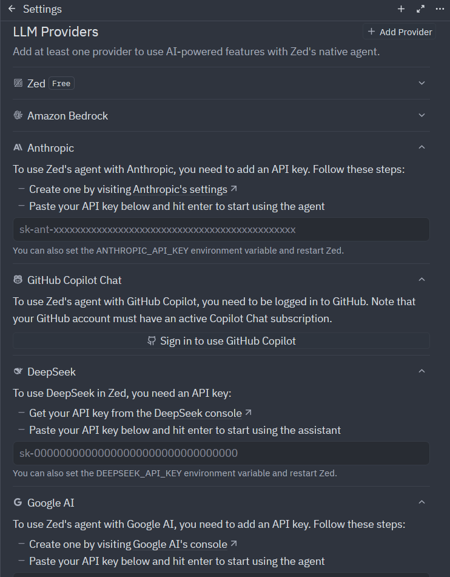

## AI Assistant untuk Vibe Coding di Zed 

Window Zed Agent bisa digunakan untuk menanyakan hal-hal apa saja yang terkait dengan *coding* maupun hal terkait lainnya setelah model diaktifkan. Berikut adalah contoh pertanyaan dan jawaban:

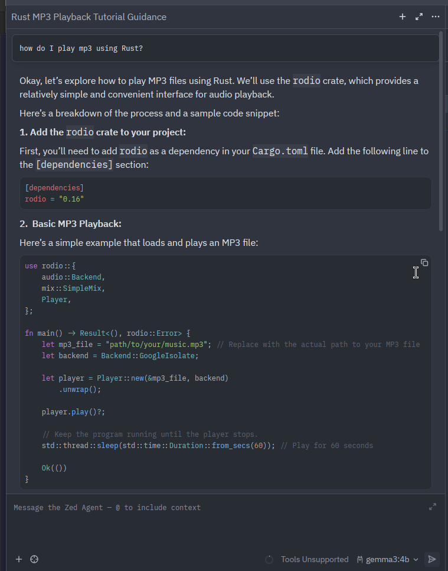

Zed Agent juga bisa digunakan pada level file source code saat source code aktif di editor. Saat sudah berada di editor, pada bagian kanan atas dari Zed akan muncul icon untuk **Inline Assist**:


Klik pada **Inline Assist** tersebut, atau tekan **Ctrl-Enter**. Saat pertama kali di-klik dan Zed Agent dalam kondisi belum aktif, Zed Agent harus mengaktifkan model terlebih dahulu (**catatan**: hal ini tidak diperlukan jika model sudah diaktifkan):


Piliih **Configure**, pilih **Ollama** kemudian klik pada **Connect**:


Zed akan terkoneksi ke Ollama dan model sesuai dengan settings.json. Jika terkoneksi, maka akan muncul tampilan berikut:


Setelah itu, AI Inline Assist bisa digunakan. 

## MCP Server dan Zed

Zed menyediakan koneksi ke MCP server. MCP Server di Zed Editor mengimplementasikan Model Context Protocol (MCP) untuk menghubungkan asisten AI di Zed dengan data, peranti, dan sistem eksternal. Kegunaan fasilitas ini adalah untuk memungkinkan asisten AI Zed "berkomunikasi" dengan aplikasi luar—seperti database, terminal, atau API—untuk mengambil konteks atau menjalankan aksi, menjadi asisten coding / programming yang lebih cerdas dan fungsional.

Untuk mengaktifkan MCP server, pada window Zed Agent, pilih **Change Model** di kanan bawah atau tekan **Ctrl-Alt-/** dan kemudian pilih **Configure** atau **Ctrl-Alt-C**. Pilih **Model Context Protocol (MCP) Servers** - **Add Server** - **Install from Extensions**. Untuk contoh, kita akan menggunakan MCP server dari [Context7](https://context7.com/) yang memungkinkan menanyakan menggunakan bahasa alami untuk berbagai kasus pemrograman yang melibatkan Next.js, Tailwind CSS, dan lain-lain. 

**Catatan:** anda bisa memilih MCP server yang disediakan dalam bentuk Zed extension melalui menu yang sama. 

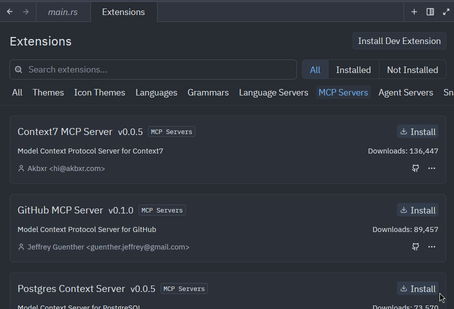

Install Context7 MCP Server dengan klik pada ikon dan text **Install** di sebelah kanan. Context7 menyediakan akses pemanggilan API gratis sampai 1000 pemanggilan. Untuk mendapatkan akses ini, sila mendaftar pada web Context7 dan kemudian [sign-in](https://context7.com/sign-in). Setelah pendaftaran selesai, masuk ke [dashboard](https://context7.com/dashboard) kemudian klik pada **Create API Key**. Isikan nama (bebas):

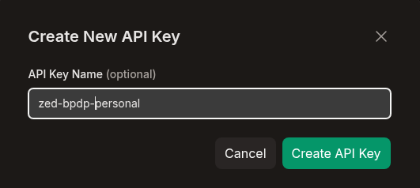

Setelah itu, API key akan dihasilkan:

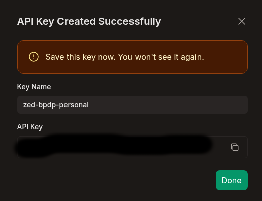

Simpan API key tersebut di tempat aman dan kemudian isikan API key tersebut pada dialog di Zed yang muncul setelah instalasi Context7 MCP Server selesai:

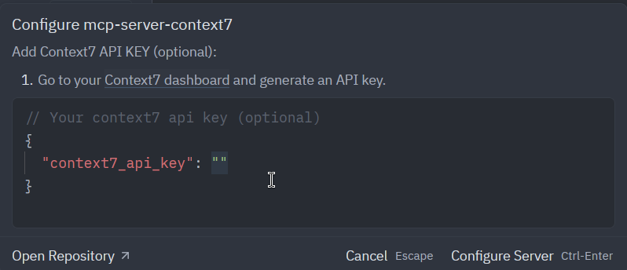

Untuk menyimpan: **Ctrl-Enter** atau klik pada **Configure Server**. Selanjutnya Zed akan terkoneksi ke Context7 MCP server:

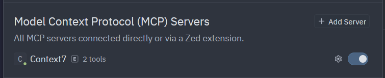

Untuk contoh penggunaan, berikan pertanyaan di Zed Agent dan diakhiri dengan **use context7**:

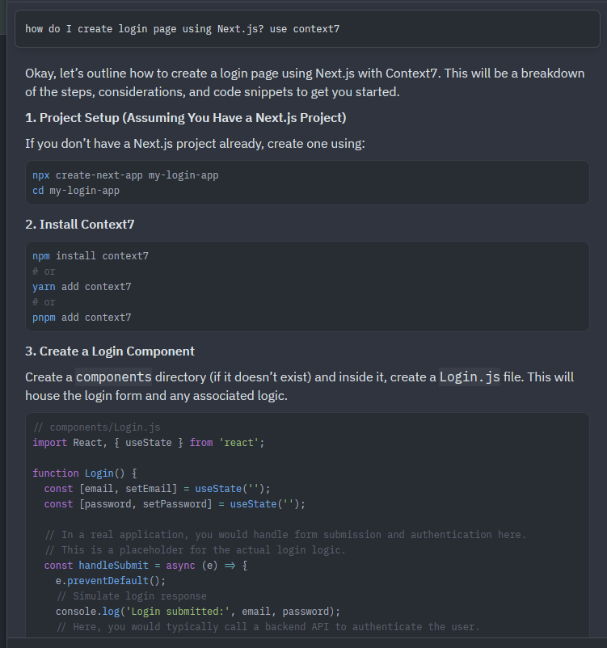

## Kolaborasi di Zed 

### Login di Zed 

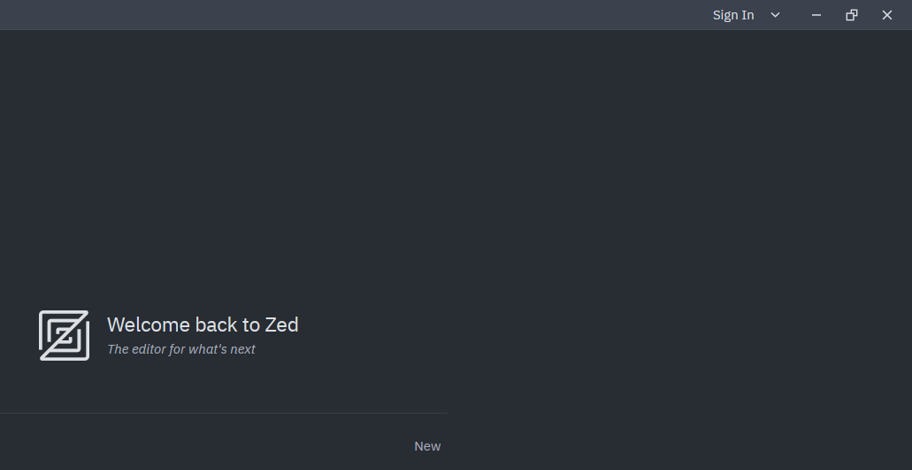


### Memulai Kolaborasi

Tekan Crtl-Shift-C, Zed akan memunculkan dialog untuk *Connect* di sebelah kiri.


Klik pada **Connect**, Zed akan menampilkan channel yang ada. Secara default, tidak ada channel yang akan dimunculkan.

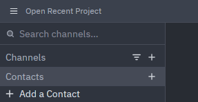

### Membuat Channel

Jika diperlukan, anda bisa membuat channel anda sendiri dan kemudian bekerja sama dengan kontributor lain dalam channel yang anda buat tersebut. Jika anda menjadi pembuat channel, maka posisi anda menjadi administrator dari channel tersebut. Channel bisa dibuat dengan mengklik pada tanda **+** di kiri atas:

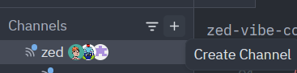

Misal kita akan membuat channel **NEO-X School**, setelah klik tanda **+** dan mengisikan nama channel, akan dimunculkan dialog. Default dari channel adalah tidak public. Jika ingin membuat orang lain bisa mencari channel, buatlah channel menjadi *Public*.

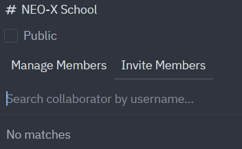

JIka ingin mengatur menjadi Public dan/atau mengatur anggota channel, klik kanan pada nama channel dan kemudian pilih *Manage Members*.


Sebagai admin, anda juga bisa membuat subchannel dengan klik kanan, memilih *New Subchannel* dan kemudian mengisikan. Subchannel ini bisa anda buat juga pada subchannel.

Pada channel yang dibuat, admin bisa meng-*invite* member dengan klik kanan kemudian *Manage Members* dan kemudian memilih pada *Invite Member*:


Isikan nama user (sesuai username di GitHub) yang akan di-*invite*:

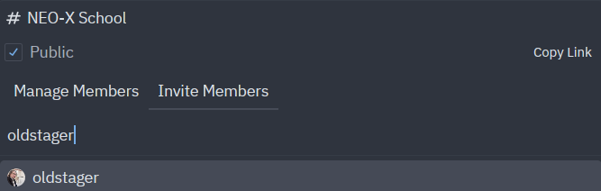

User yang di-*invite* akan mendapatkan pemberitahuan dan bisa memilih tanda centang untuk menerima *invitation*:

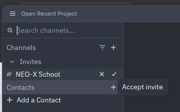

Jika sudah terkoneksi dalam channel / subchennel, maka bisa dilakukan sharing dengan klik pada **Share** di bagian kanan atas Zed.

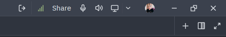

*Members* yang berada pada (sub)channel tersebut kemudian akan mendapat pemberitahun dan kemudian bisa menerima dengan klik pada **Open**:


Setelah member menerima, maka member tersebut mendapatkan tampilan proyek yang di*share* dan kemudian bisa aktif melakukan proses editing seperti halnya seakan-akan proyek tersebut berada pada Zed lokal member tersebut.

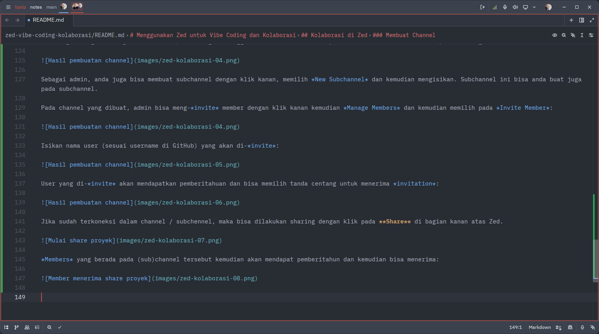

Klik pada **Unshare* jika sudah selesai dengan sharing proyek. *Members* akan mendapatkan pemberitahuan diskonek:

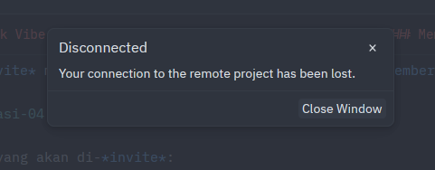

**Catatan**: setiap member bisa melakukan *sharing project*, tidak hanya admin saja. 

Kita juga bisa melakukan *invitation* kontak:

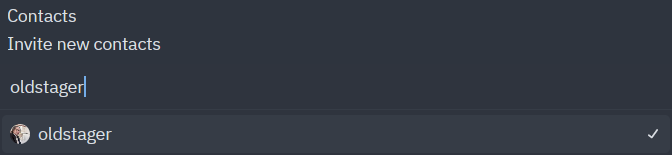

Kontak yang kita *invite* akan mendapatkan pemberitahuan dan bisa klik pada tanda centang untuk menerima:

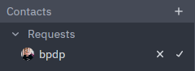

## Referensi 

1.  [Dokumentasi Zed](https://zed.dev/docs/)
2.  [The Complete Guide to Ollama: Run Large Language Models Locally](https://dev.to/ajitkumar/the-complete-guide-to-ollama-run-large-language-models-locally-2mge)
3.  [Dokumentasi Ollama](https://docs.ollama.com/)
4.  [Llama.cpp vs Ollama: Choosing the Best Local LLM Tool in 2026](https://www.openxcell.com/blog/llama-cpp-vs-ollama/)
5.  [Setting up a lightweight vibe-coding lab with Zed and Ollama, step-by-step](https://medium.com/h7w/setting-up-a-lightweight-vibe-coding-lab-with-zed-and-ollama-step-by-step-fe7ea6c99fb9)
