# Menggunakan Zed untuk Vibe Coding dan Kolaborasi

| Penulis | Peran |
| -------- | ---------- |
| Dr. Bambang Purnomosidi D. P. | Penulis utama |

Update tarakhir: **18 April 2026**

## Instalasi Prasyarat

### Install Zed 


Akses ke https://zed.dev/download, setelah itu pilih sesuai dengan sistem operasi yang digunakan. Jika menggunakan Linux, Zed akan diinstall di *home directory* (`$HOME`) dan setiap dijalankan akan secara otomatis memeriksa rilis terbaru dan kemudian melakukan proses update jika terdapat versi baru. 

### Instalasi Ollama

```bash 
$ curl -fsSL https://ollama.com/install.sh | sh
>>> Cleaning up old version at /usr/local/lib/ollama
[sudo] password for bpdp: 
>>> Installing ollama to /usr/local
>>> Downloading ollama-linux-amd64.tar.zst
######################################################################## 100.0%
>>> NVIDIA GPU installed.
>>> The Ollama API is now available at 127.0.0.1:11434.
>>> Install complete. Run "ollama" from the command line.
$
```

Instalasi akan dilakukan di `/usr/local/lib/ollama` dan `/usr/local/bin/`

```bash 
total 6492
drwxr-xr-x 6 root root    4096 Apr 18 17:28 .
drwxr-xr-x 3 root root    4096 Apr 18 17:20 ..
drwxr-xr-x 2 root root    4096 Apr 17 11:14 cuda_v12
drwxr-xr-x 2 root root    4096 Apr 17 11:03 cuda_v13
lrwxrwxrwx 1 root root      20 Apr 17 10:54 include -> mlx_cuda_v13/include
lrwxrwxrwx 1 root root      17 Apr 17 10:54 libggml-base.so -> libggml-base.so.0
lrwxrwxrwx 1 root root      21 Apr 17 10:54 libggml-base.so.0 -> libggml-base.so.0.0.0
-rwxr-xr-x 1 root root  748152 Apr 17 10:54 libggml-base.so.0.0.0
-rwxr-xr-x 1 root root  873912 Apr 17 10:54 libggml-cpu-alderlake.so
-rwxr-xr-x 1 root root  873912 Apr 17 10:54 libggml-cpu-haswell.so
-rwxr-xr-x 1 root root 1009080 Apr 17 10:54 libggml-cpu-icelake.so
-rwxr-xr-x 1 root root  820728 Apr 17 10:54 libggml-cpu-sandybridge.so
-rwxr-xr-x 1 root root 1009080 Apr 17 10:54 libggml-cpu-skylakex.so
-rwxr-xr-x 1 root root  636536 Apr 17 10:54 libggml-cpu-sse42.so
-rwxr-xr-x 1 root root  632472 Apr 17 10:54 libggml-cpu-x64.so
drwxr-xr-x 3 root root    4096 Apr 17 11:14 mlx_cuda_v13
drwxr-xr-x 2 root root    4096 Apr 17 11:01 vulkan
$ ls -la /usr/local/bin/
total 42384
drwxr-xr-x  2 root root     4096 Apr 18 17:21 .
drwxr-xr-x 11 root root     4096 Feb 28 21:01 ..
-rwxr-xr-x  1 root root 43386024 Apr 17 10:38 ollama
$ 
```

Jika ingin meng-update Ollama, gunakan perintah instalasi di atas lagi. 

### Instalasi Model LLM 

Untuk aktivitas *coding*, pada dasarnya ada beberapa yang bisa digunakan. 

1. Instalasi lokal 

Cara ini digunakan jika kita mempunyai *resources* yang mencukupi. 

```bash 
$ ollama run codellama
pulling manifest 
pulling 3a43f93b78ec: 100% ▕█████████████████████████████████████████████████████████████████████████████████████████████████████████████▏ 3.8 GB                         
pulling 8c17c2ebb0ea: 100% ▕█████████████████████████████████████████████████████████████████████████████████████████████████████████████▏ 7.0 KB                         
pulling 590d74a5569b: 100% ▕█████████████████████████████████████████████████████████████████████████████████████████████████████████████▏ 4.8 KB                         
pulling 2e0493f67d0c: 100% ▕█████████████████████████████████████████████████████████████████████████████████████████████████████████████▏   59 B                         
pulling 7f6a57943a88: 100% ▕█████████████████████████████████████████████████████████████████████████████████████████████████████████████▏  120 B                         
pulling 316526ac7323: 100% ▕█████████████████████████████████████████████████████████████████████████████████████████████████████████████▏  529 B                         
verifying sha256 digest 
writing manifest 
success 
>>> Send a message (/? for help)
```


Untuk menguji:

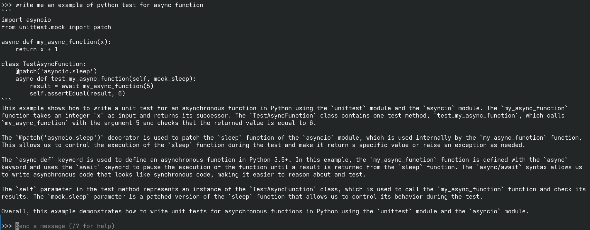

Setelah proses di atas, model `codellama` sudah berada di lokal komputer kita, periksa dengan perintah berikut:

```bash
$ ollama serve
time=2026-04-18T17:31:55.045+07:00 level=INFO source=routes.go:1752 msg="server config" env="map[CUDA_VISIBLE_DEVICES: GGML_VK_VISIBLE_DEVICES: GPU_DEVICE_ORDINAL: HIP_VISIBLE_DEVICES: HSA_OVERRIDE_GFX_VERSION: HTTPS_PROXY: HTTP_PROXY: NO_PROXY: OLLAMA_CONTEXT_LENGTH:0 OLLAMA_DEBUG:INFO OLLAMA_DEBUG_LOG_REQUESTS:false OLLAMA_EDITOR: OLLAMA_FLASH_ATTENTION:false OLLAMA_GPU_OVERHEAD:0 OLLAMA_HOST:http://127.0.0.1:11434 OLLAMA_KEEP_ALIVE:5m0s OLLAMA_KV_CACHE_TYPE: OLLAMA_LLM_LIBRARY: OLLAMA_LOAD_TIMEOUT:5m0s OLLAMA_MAX_LOADED_MODELS:0 OLLAMA_MAX_QUEUE:512 OLLAMA_MODELS:/home/bpdp/.ollama/models OLLAMA_MULTIUSER_CACHE:false OLLAMA_NEW_ENGINE:false OLLAMA_NOHISTORY:false OLLAMA_NOPRUNE:false OLLAMA_NO_CLOUD:false OLLAMA_NUM_PARALLEL:1 OLLAMA_ORIGINS:[http://localhost https://localhost http://localhost:* https://localhost:* http://127.0.0.1 https://127.0.0.1 http://127.0.0.1:* https://127.0.0.1:* http://0.0.0.0 https://0.0.0.0 http://0.0.0.0:* https://0.0.0.0:* app://* file://* tauri://* vscode-webview://* vscode-file://*] OLLAMA_REMOTES:[ollama.com] OLLAMA_SCHED_SPREAD:false OLLAMA_VULKAN:false ROCR_VISIBLE_DEVICES: http_proxy: https_proxy: no_proxy:]"
time=2026-04-18T17:31:55.045+07:00 level=INFO source=routes.go:1754 msg="Ollama cloud disabled: false"
time=2026-04-18T17:31:55.046+07:00 level=INFO source=images.go:517 msg="total blobs: 6"
time=2026-04-18T17:31:55.046+07:00 level=INFO source=images.go:524 msg="total unused blobs removed: 0"
time=2026-04-18T17:31:55.046+07:00 level=INFO source=routes.go:1810 msg="Listening on 127.0.0.1:11434 (version 0.21.0)"
time=2026-04-18T17:31:55.046+07:00 level=INFO source=runner.go:67 msg="discovering available GPUs..."
time=2026-04-18T17:31:55.047+07:00 level=INFO source=server.go:444 msg="starting runner" cmd="/usr/local/bin/ollama runner --ollama-engine --port 40633"
time=2026-04-18T17:31:55.277+07:00 level=INFO source=server.go:444 msg="starting runner" cmd="/usr/local/bin/ollama runner --ollama-engine --port 41357"
time=2026-04-18T17:31:55.494+07:00 level=INFO source=runner.go:106 msg="experimental Vulkan support disabled.  To enable, set OLLAMA_VULKAN=1"
time=2026-04-18T17:31:55.494+07:00 level=INFO source=server.go:444 msg="starting runner" cmd="/usr/local/bin/ollama runner --ollama-engine --port 36945"
time=2026-04-18T17:31:55.494+07:00 level=INFO source=server.go:444 msg="starting runner" cmd="/usr/local/bin/ollama runner --ollama-engine --port 44305"
time=2026-04-18T17:31:55.717+07:00 level=INFO source=types.go:42 msg="inference compute" id=GPU-fc21007c-4634-492e-c993-6a12b208dce2 filter_id="" library=CUDA compute=8.6 name=CUDA0 description="NVIDIA GeForce RTX 2050" libdirs=ollama,cuda_v13 driver=13.2 pci_id=0000:01:00.0 type=discrete total="4.0 GiB" available="3.7 GiB"
time=2026-04-18T17:31:55.717+07:00 level=INFO source=routes.go:1860 msg="vram-based default context" total_vram="4.0 GiB" default_num_ctx=4096
[GIN] 2026/04/18 - 17:32:01 | 200 |     131.576µs |       127.0.0.1 | HEAD     "/"
[GIN] 2026/04/18 - 17:32:01 | 200 |    3.264581ms |       127.0.0.1 | GET      "/api/tags"
```

Pada posisi tersebut, model `codellama` sudan terinstall di lokal komputer:

```bash
$ ollama list
NAME                ID              SIZE      MODIFIED   
codellama:latest    8fdf8f752f6e    3.8 GB    8 days ago  
$
```

Berikut adalah penambahan satu model lagi yaitu [gemma3:4b](https://ollama.com/library/gemma3). Tentu saja model bisa ditambah sekehendak hati asal mempunyai *resources* yang mencukupi. Jika ingin menambah lagi, bisa mencari model yang sesuai di [Ollama supported models](https://ollama.com/search).

```bash
$ ollama pull gemma3:4b
pulling manifest 
pulling aeda25e63ebd: 100% ▕█████████████████████████████████████████████████████████████████████████████████████████████████████████████▏ 3.3 GB                         
pulling e0a42594d802: 100% ▕█████████████████████████████████████████████████████████████████████████████████████████████████████████████▏  358 B                         
pulling dd084c7d92a3: 100% ▕█████████████████████████████████████████████████████████████████████████████████████████████████████████████▏ 8.4 KB                         
pulling 3116c5225075: 100% ▕█████████████████████████████████████████████████████████████████████████████████████████████████████████████▏   77 B                         
pulling b6ae5839783f: 100% ▕█████████████████████████████████████████████████████████████████████████████████████████████████████████████▏  489 B                         
verifying sha256 digest 
writing manifest 
success 
$
```


```bash
$ ollama list
NAME                ID              SIZE      MODIFIED      
gemma3:4b           a2af6cc3eb7f    3.3 GB    2 minutes ago    
codellama:latest    8fdf8f752f6e    3.8 GB    8 days ago
$
```

Setelah itu, konfigurasi Zed. Buka menu Zed - Open Settings, pilih AI di sisi sebelah kiri. Setelah itu klik pada **Edit in settings.json**:

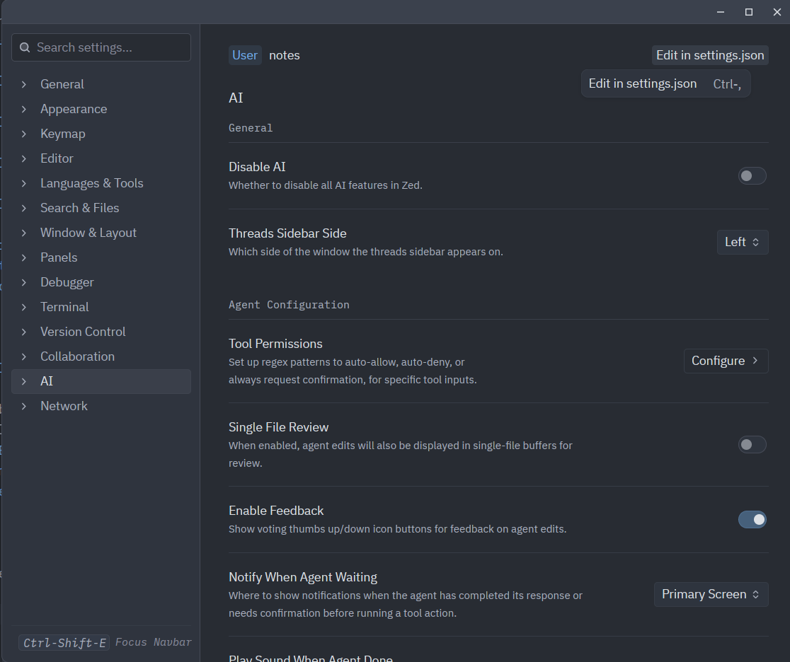

Setelah itu, konfigurasikan sebagai berikut:

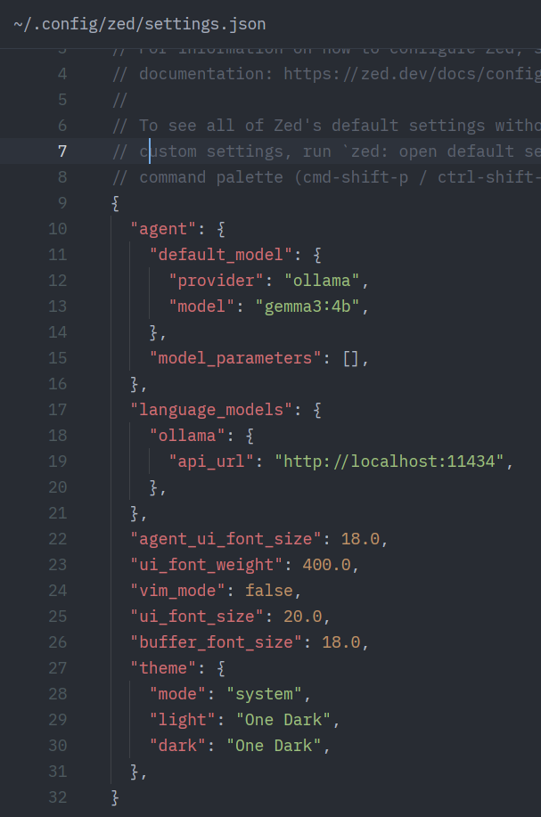

Pastikan bahwa **ollama** sudah berjalan di localhost pada port sesuai dengan *setting* di atas. Jika sudah, pada bagian kanan atas dari Zed akan muncul icon untuk **Inline Assist**:

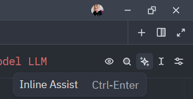

Klik pada **Inline Assist** tersebut, atau tekan **Ctrl-Enter**. Saat pertama kali di-klik, Zed harus mengaktifkan terlebih dahulu. 

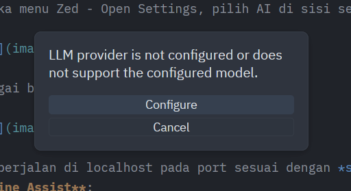

Piliih **Configure**, pilih **Ollama** kemudian klik pada **Connect**:

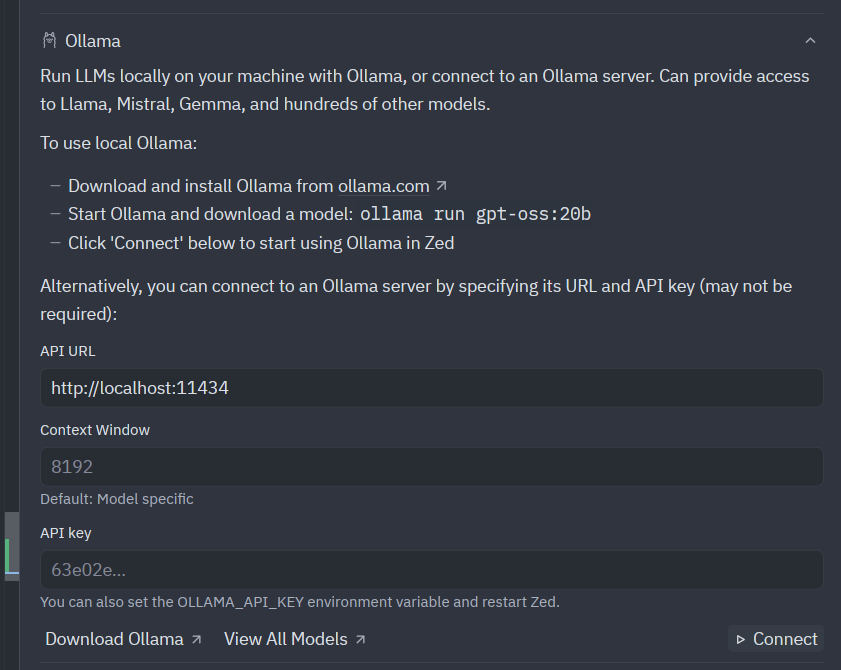

Zed akan terkoneksi ke Ollama dan model sesuai dengan settings.json. Jika terkoneksi, maka akan muncul tampilan berikut:

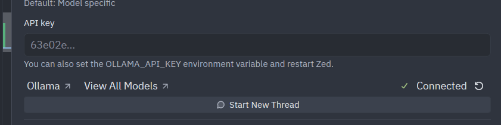

Setelah itu, AI Inline Assist bisa digunakan. Sebagai contoh, kita akan membuat *command line mp3 player menggunakan bahasa pemrograman Rust*. Buat proyek baru Rust, *open* di Zed, kemudian Klik pada **Inline Assiste**.

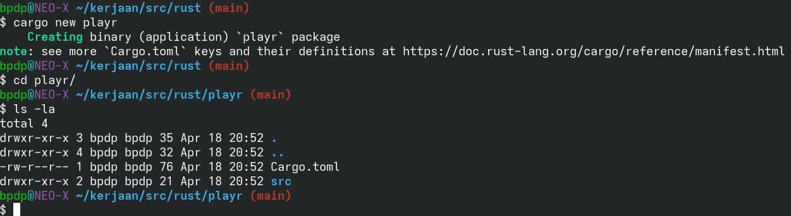

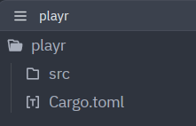

Buka `src/main.rs` di editor kemudian klik pada *Inline Assistant*:

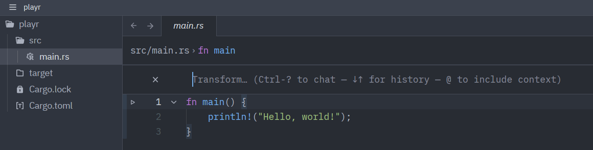


2.  Menggunakan OpenRouter


## AI Assistant untuk Vibe Coding di Zed 


## Kolaborasi di Zed 

### Login di Zed 


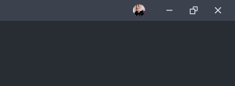

### Memulai Kolaborasi

Tekan Crtl-Shift-C, Zed akan memunculkan dialog untuk *Connect* di sebelah kiri.

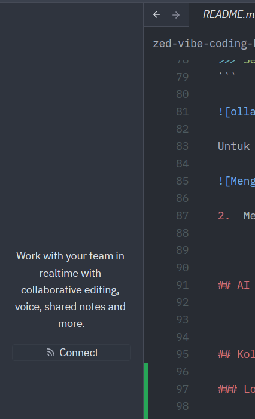

Klik pada **Connect**, Zed akan menampilkan channel yang ada. Secara default, tidak ada channel yang akan dimunculkan.


### Membuat Channel

Jika diperlukan, anda bisa membuat channel anda sendiri dan kemudian bekerja sama dengan kontributor lain dalam channel yang anda buat tersebut. Jika anda menjadi pembuat channel, maka posisi anda menjadi administrator dari channel tersebut. Channel bisa dibuat dengan mengklik pada tanda **+** di kiri atas:


Misal kita akan membuat channel **NEO-X School**, setelah klik tanda **+** dan mengisikan nama channel, akan dimunculkan dialog. Default dari channel adalah tidak public. Jika ingin membuat orang lain bisa mencari channel, buatlah channel menjadi *Public*.


JIka ingin mengatur menjadi Public dan/atau mengatur anggota channel, klik kanan pada nama channel dan kemudian pilih *Manage Members*.

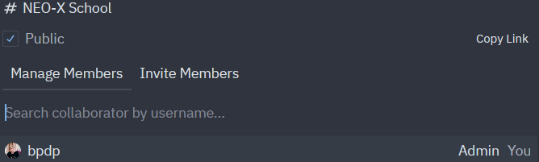

Sebagai admin, anda juga bisa membuat subchannel dengan klik kanan, memilih *New Subchannel* dan kemudian mengisikan. Subchannel ini bisa anda buat juga pada subchannel.

Pada channel yang dibuat, admin bisa meng-*invite* member dengan klik kanan kemudian *Manage Members* dan kemudian memilih pada *Invite Member*:


Isikan nama user (sesuai username di GitHub) yang akan di-*invite*:


User yang di-*invite* akan mendapatkan pemberitahuan dan bisa memilih tanda centang untuk menerima *invitation*:


Jika sudah terkoneksi dalam channel / subchennel, maka bisa dilakukan sharing dengan klik pada **Share** di bagian kanan atas Zed.


*Members* yang berada pada (sub)channel tersebut kemudian akan mendapat pemberitahun dan kemudian bisa menerima dengan klik pada **Open**:

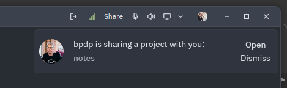

Setelah member menerima, maka member tersebut mendapatkan tampilan proyek yang di*share* dan kemudian bisa aktif melakukan proses editing seperti halnya seakan-akan proyek tersebut berada pada Zed lokal member tersebut.


Klik pada **Unshare* jika sudah selesai dengan sharing proyek. *Members* akan mendapatkan pemberitahuan diskonek:


**Catatan**: setiap member bisa melakukan *sharing project*, tidak hanya admin saja. 

Kita juga bisa melakukan *invitation* kontak:


Kontak yang kita *invite* akan mendapatkan pemberitahuan dan bisa klik pada tanda centang untuk menerima:


